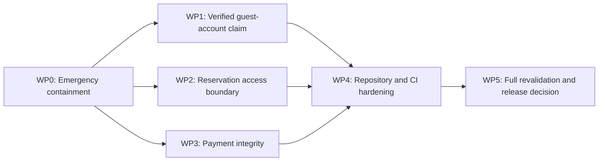

# Codex Security Findings Implementation Plan

**Created:** 2026-07-12
**Scope:** Remediation of the seven findings validated against `ad6dcb7d359d66c4fc3d97fd6094f6667d02d4bb` and current `origin/main`
**Evidence:** `codex-security-findings-2026-07-12T16-07-36.816Z.csv` and the derived validation summary
**Status:** Approved implementation guidance; no finding is closed until its acceptance and release gates pass
**Delivery model:** Emergency containment followed by four reviewable implementation work packages

## 1. Objective

We need to remove the currently reachable account-claim, reservation disclosure/cancellation, payment-integrity, secret-exposure, and dependency-review weaknesses without weakening the existing public booking flow or mixing unrelated feature work into the security change.

This document is executable guidance. It defines ordering, change boundaries, security invariants, expected source locations, tests, rollout, rollback, and acceptance gates. A merged code change is not sufficient evidence of closure: each original vulnerable path must be revalidated against the resulting build and the deployed configuration.

## 2. Validated Finding Inventory

| ID | Finding | Current disposition | Implementation package |
| --- | --- | --- | --- |
| `05d3e4b9` | Unverified email claim exposes guest reservations | Reportable, critical | WP1 |
| `a6b2507e` | Public lookup exposes sensitive driver data | Reportable, high | WP2 |
| `16542709` | Production deployment defaults to mock payment | Reportable, high | WP3 |
| `3f489d71` | Tracked scan artifacts expose service tokens | Reportable, high | WP0 and WP4 |
| `151e6b3c` | Forged 3DS callbacks can mark reservations paid | Reportable, high | WP3 |
| `ca53a468` | Dependabot auto-merge bypasses human dependency review | Reportable, high | WP4 |
| `6bf4756e` | Unauthenticated reservation PII access and cancellation | Reportable, high | WP2 |

The seven rows represent five root-control families. We will preserve every row in verification so that grouping does not hide an unclosed instance.

## 3. Security Gap Analysis Checkpoint

The planning checkpoint found the following gaps. Items marked as unknown require operational confirmation and cannot be closed through source changes alone.

| Boundary | Observed gap | Required control | Proof required |
| --- | --- | --- | --- |
| Guest customer to authenticated customer | Knowing an email is enough to install a password on an existing guest record | Single-use, expiring proof of email control before credential installation | Negative and positive integration tests plus token replay test |
| Public reservation lookup | Public code returns the broad internal `ReservationDto` | Dedicated allowlisted public response or authenticated owner response | Contract test proving sensitive fields are absent |
| Public cancellation | GUID alone reaches reservation state mutation | Authenticated customer ownership or a separately issued scoped action capability | Anonymous/foreign-customer rejection tests |
| Browser to payment state | Arbitrary `BankResponse` reaches provider success and `Paid` | Provider-authenticated, amount/currency/intent-bound verification | Forged callback rejection and real sandbox success evidence |
| Production configuration | Missing/unknown provider silently selects Mock | Production startup validation that fails closed | Container startup-failure test and production config checklist |
| Repository to service credentials | Generated reports contain cleartext tokens and remain tracked | Rotation, history treatment, artifact exclusion, secret scanning | Provider-side rotation record and repository/history scan |
| Dependency update to `main` | Patch/minor updates can auto-approve and auto-merge | Human dependency review or a narrowly scoped allowlist with independent policy | Workflow review and branch-protection evidence |
| Logging and audit | Security flows may log email or provider payloads | PII-minimized structured audit actions | Log assertions and manual review |

### 3.1 Reviewed Areas

- Customer registration and customer reservation authorization.
- Public reservation read and cancellation routes.
- Payment intent completion, provider selection, mock/Iyzico verification, and production Compose settings.
- Tracked Ship Safe artifacts.
- Dependabot auto-merge workflow.

### 3.2 Unreviewed or Operationally Unknown Areas

- No provider-shaped scanner candidate remains operationally unknown. The Resend match had no application/deployment/account anchor. The three Upstash-shaped matches were arbitrary substrings inside Base64-encoded gzip .NET telemetry and disappeared after decoding; they were not provider credentials.
- The actual Dokploy production environment values.
- The selected real payment provider's current API contract and webhook/3DS verification procedure.
- GitHub branch protection, environment protection, and required-review settings.
- Provider-side access logs and possible use of exposed credentials.

These unknowns are release gates, not reasons to suppress the findings.

## 4. Non-Negotiable Security Invariants

1. Knowledge of an email address must never install credentials on an existing customer record.
2. Authentication must be bound to the customer who completed an out-of-band proof, not merely to a matching normalized email.
3. Public reservation responses must be allowlisted and must not reuse internal/admin DTOs.
4. Reservation cancellation must require an authenticated owner or a dedicated, short-lived, single-purpose capability.
5. A reservation may enter `Paid` only after server-to-server verification binds provider transaction, local intent, reservation, amount, currency, and a successful provider state.
6. Production must refuse startup when payment configuration is absent, unknown, mock, sandbox, incomplete, or enables unverified processing. An explicit `Disabled` provider is permitted only with `EnablePayments=false` and must never fall back to Mock.
7. Generated security artifacts must never contain or commit cleartext secrets.
8. Dependency changes must not satisfy their own human-review requirement.
9. Security logs must record action, result, actor type, and correlation data without tokens, raw payment payloads, identity numbers, or unnecessary email/phone values.

## 5. Change Boundaries

- Preserve unrelated reservation-extra, admin UX, pricing, public-content, and user-owned untracked work.
- Do not redesign the entire authentication subsystem while fixing guest account claim.
- Do not introduce a new payment provider library until its official integration contract and version are selected and reviewed.
- Do not keep the vulnerable endpoint behind an undocumented frontend convention; controls must be enforced by the API.
- Do not mark findings resolved from unit tests alone. Relevant integration, Docker, browser, configuration, and operational gates remain explicit.
- Do not include generated scan reports, secrets, provider payloads, or production data in test fixtures.

## 6. Delivery Sequence



WP1, WP2, and WP3 may be implemented on separate branches after WP0. They should remain separate PRs unless a shared migration makes separation unsafe. WP4 and WP5 must evaluate the combined result.

## 7. WP0 - Emergency Containment

### 7.1 Purpose

Reduce exposure before the complete code solution is ready. This package includes operational actions and the smallest reversible source/config changes.

### 7.2 Actions

1. Preserve the provider-candidate triage record. The Resend-shaped match had no project/provider anchor; the three Upstash-shaped matches occurred only inside Base64-encoded gzip `.NET TelemetryStorageService` lines and were absent from the decoded telemetry JSON.
2. Do not create fictional rotation or provider-log evidence for these non-actionable scanner matches. Reopen containment only if independent evidence identifies an issued project credential.
3. Remove `.ship-safe/context.json`, `.ship-safe/history.json`, and `ship-safe-report.html` from tracking. Preserve any needed sanitized report outside the repository.
4. Add generated Ship Safe paths and equivalent security-report outputs to `.gitignore`.
5. Run a history-aware secret scanner. Decide whether history rewriting is necessary based on repository visibility, clone population, and rotation completion; rotation remains mandatory either way.
6. Disable public payment completion in production until WP3 is deployed. Prefer an explicit feature flag that defaults to disabled in Production and returns `503` without mutating state.
7. Disable the anonymous public cancellation route immediately. The authenticated customer route remains available.
8. Temporarily stop Dependabot auto-merge while WP4 policy is reviewed.

### 7.3 Acceptance Criteria

- The Resend and Upstash-shaped matches have sanitized `not_actionable` triage evidence; no rotation record is required without independent proof of an issued credential.
- Tracked files and the current working tree contain no matching live secret values.
- Anonymous public cancellation cannot reach `CancelReservationAsync`.
- Production cannot complete a payment while the emergency disable flag is active.
- Dependabot PRs require manual action.

### 7.4 Rollback

Do not roll back credential rotation. The payment/cancellation containment flags may be reverted only after WP2/WP3 acceptance passes. Generated secret-bearing artifacts must not be reintroduced.

## 8. WP1 - Verified Guest-Account Claim

### 8.1 Design Decision

We will separate registration from claiming an existing passwordless guest customer. A request containing an email may initiate a claim, but only possession of a single-use email token may install the first password on the existing customer.

### 8.2 Domain and Persistence

Add a purpose-specific entity such as `CustomerAccountClaimToken` rather than overloading password-reset semantics. Persist:

- `Id`;
- `CustomerId`;
- cryptographic token hash, never the raw token;
- `ExpiresAtUtc`;
- `UsedAtUtc`;
- `CreatedAtUtc`;
- bounded request metadata needed for abuse monitoring, excluding raw secrets and unnecessary PII.

Add an index supporting active-token lookup and cleanup. Token lifetime should be short and configuration-bound. Issuing a new token should invalidate or supersede previous unused claim tokens for the same customer.

Expected anchors:

- `backend/src/RentACar.Core/Entities/`
- `backend/src/RentACar.Infrastructure/Data/Configurations/`
- `backend/src/RentACar.Infrastructure/Data/Migrations/`
- `backend/src/RentACar.API/Controllers/CustomerAuthController.cs`
- `backend/src/RentACar.API/Contracts/Auth/`
- existing email service and background-delivery patterns

### 8.3 API Flow

1. `POST /api/customer/v1/auth/register` keeps a generic response for all cases.
2. New email: create a new customer according to the chosen email-verification policy. Do not weaken existing password validation.
3. Existing customer with a password: do not change credentials; return the same generic response.
4. Existing customer without a password: create and email a claim token; do not change profile or `PasswordHash`.
5. Add `POST /api/customer/v1/auth/claim` accepting the raw one-time token and new password.
6. In one transaction, validate token hash, purpose, expiry, unused state, customer state, and concurrency; then install the password and consume all active claim tokens.
7. Do not copy attacker-supplied profile fields onto an existing guest record during claim initiation. Profile updates happen only after authenticated login.
8. Revoke existing customer sessions if future flows permit credential replacement; first-time claim normally has no prior authenticated session.

### 8.4 Abuse Controls

- Strict IP and normalized-account rate limits.
- Generic responses and near-uniform behavior to reduce account enumeration.
- Audit events: `CustomerClaimRequested`, `CustomerClaimCompleted`, `CustomerClaimRejected` with non-sensitive identifiers.
- No raw token, password, email body, identity number, or phone in logs.
- Background cleanup for expired tokens.

### 8.5 Required Tests

- Knowing a guest customer's email cannot set or change `PasswordHash`.
- A valid claim token installs a password for the intended customer only.
- Expired, used, malformed, wrong-customer, and replayed tokens fail.
- Concurrent use permits exactly one successful claim.
- Initiation does not overwrite name, phone, identity number, birth date, nationality, or license fields.
- Existing registered email returns the same public response and does not change credentials.
- Successful claim permits login and access only to that customer's reservations.
- Logs and queued email metadata contain no raw password or stored token.

### 8.6 Exit Gate

Re-run the original critical attack path through the real HTTP API with PostgreSQL and the configured email test double. The attacker who knows only the victim email must not obtain a session or alter the victim record.

## 9. WP2 - Reservation Read and Mutation Boundary

### 9.1 Public Read Contract

Create a dedicated `PublicReservationSummaryDto` and a dedicated mapper/query. Do not map to `ReservationDto` and remove properties afterward.

The public response should contain only fields needed for a confirmation/status page, for example:

- public reservation code;
- coarse reservation status;
- pickup/return office display names;
- pickup/return timestamps;
- public vehicle-group display data;
- currency and customer-facing total if product requirements require it.

It must exclude internal GUIDs, customer ID/name/email/phone, plate, driver data, identity/license fields, customer statistics, notes, hold session IDs, internal pricing metadata, and payment/provider identifiers.

Expected anchors:

- `backend/src/RentACar.API/Contracts/Reservations/ReservationDtos.cs`
- `backend/src/RentACar.API/Controllers/ReservationsController.cs`
- `backend/src/RentACar.API/Services/IReservationService.cs`
- `backend/src/RentACar.API/Services/ReservationService.cs`
- `backend/src/RentACar.Infrastructure/Repositories/ReservationRepository.cs`

### 9.2 Cancellation Decision

Remove `POST /api/v1/reservations/{reservationId}/cancel` from the anonymous controller. Use the existing authenticated customer endpoint as the supported self-service path:

- require `CustomerOnly` policy;
- load the reservation;
- compare `reservation.CustomerId` with the validated token subject;
- return the same not-found response for absent and foreign resources;
- enforce cancellable-state business rules in the service;
- make concurrent/repeated cancellation idempotent or deterministically rejected.

If the product later requires cancellation without an account, design a separate short-lived cancellation capability bound to reservation, action, expiry, and one-time use. A public code or reservation GUID must not serve as that capability.

### 9.3 Public-Code Controls

- Confirm public codes are generated with cryptographically strong randomness and sufficient entropy.
- Apply strict rate limiting and uniform not-found behavior.
- Do not log full public codes; use a bounded fingerprint when correlation is necessary.
- Add cache headers preventing shared/proxy storage of reservation responses.

### 9.4 Required Tests

- Anonymous public lookup response schema contains none of the forbidden fields.
- Serialized nested objects also contain no driver, customer, hold-session, note, or provider data.
- Anonymous public cancellation returns `404` or `405` and performs no write.
- Authenticated owner cancellation succeeds for allowed states.
- Foreign customer cancellation returns not found and performs no write.
- Admin cancellation continues through the admin-only route.
- Public code enumeration is rate-limited and responses are not cacheable.
- Existing public confirmation UI renders correctly using the minimal contract in all five locales.

### 9.5 Exit Gate

Run API contract tests and Docker/Chromium confirmation-page tests. Capture a sanitized response schema as evidence. Revalidate both original PII findings and the anonymous cancellation finding separately.

## 10. WP3 - Payment Integrity and Production Fail-Closed Configuration

### 10.1 Immediate Architecture Rule

Mock and sandbox implementations are development/test capabilities only. They must be structurally unavailable in Production. Selecting an unknown provider must throw during startup instead of falling back to Mock.

### 10.2 Configuration Validation

Add startup validation covering:

- provider is explicitly configured;
- provider name is in an allowlist;
- `Mock` is rejected outside Development/Test;
- sandbox base URLs are rejected in Production;
- required API, secret, webhook, and callback configuration exists;
- callback/public base URLs are HTTPS and belong to configured hosts;
- no default webhook secret is accepted in Production.

Update:

- `backend/src/RentACar.Infrastructure/Services/Payments/PaymentOptions.cs`
- `backend/src/RentACar.API/Configuration/ServiceCollectionExtensions.cs`
- `backend/src/RentACar.API/appsettings*.json`
- `docker-compose.yml`
- `.env.example`
- `deploy/dokploy-setup.md`

Use an explicit provider switch that throws for unknown values. Compose must pass the selected provider and required settings from secret-backed environment variables.

### 10.3 Provider Verification Contract

Replace the current trust in arbitrary `BankResponse` with server-to-server verification defined by the selected provider's official contract. Before coding this adapter, fetch and review the current official provider documentation and pin the supported SDK/API version.

A successful verification result must bind:

- configured provider;
- local payment intent ID;
- stored provider intent/conversation ID;
- reservation ID;
- expected amount and currency;
- successful/settled provider status;
- unique provider transaction ID;
- callback freshness or provider event identity where applicable.

The API must reject mismatches before any reservation mutation. Raw callback payloads must not become trusted state merely because they are non-empty.

### 10.4 State Transition and Idempotency

- Implement an explicit allowed transition from pending payment to paid.
- Process completion in a transaction with concurrency protection.
- Make repeated verified events idempotent by provider event/transaction ID.
- Reject attempts against expired, failed, cancelled, already-refunded, or unrelated intents.
- Record sanitized verification outcome and correlation IDs, not full card/provider payloads.
- Keep webhook signature, timestamp, replay, and provider-name validation independent from browser return handling.

### 10.5 Endpoint Strategy

Preferred design:

1. Browser return is a navigation/status signal only.
2. The backend queries the provider or consumes a signed provider webhook.
3. Only verified server-side evidence can call the paid transition.
4. The frontend polls or fetches final status from an owner-scoped endpoint.

If the provider requires a browser-posted token, accept only the provider-issued opaque token and verify it server-to-server. Do not accept an arbitrary status string or raw success flag.

### 10.6 Required Tests

- Production startup fails when provider is missing, Mock, unknown, sandbox, or incompletely configured.
- Development/Test can intentionally select Mock.
- Arbitrary `BankResponse = "ok"` cannot mark an intent or reservation succeeded.
- Provider intent, amount, currency, reservation, or transaction mismatch is rejected.
- Invalid signature, stale timestamp, replayed event, and wrong provider are rejected.
- A verified sandbox payment makes exactly one valid paid transition.
- Concurrent duplicate completion remains idempotent.
- Failed/cancelled provider status never becomes paid.
- Refund/deposit behavior remains consistent with the verified transaction.
- No sensitive provider payload or credential is logged.

### 10.7 Exit Gate

WP3 is not complete with Mock tests. Required proof is:

- focused unit and integration tests;
- Production configuration failure tests;
- Docker startup with production-like secret injection;
- one successful and multiple negative transactions against the selected provider's sandbox;
- database evidence that forged/mismatched callbacks produced no paid transition.

## 11. WP4 - Repository, Secret, and Dependency Workflow Hardening

### 11.1 Secret Artifact Controls

- Add generated scanner directories/reports to `.gitignore`.
- Configure scanners to redact matched values in machine and HTML outputs.
- Store durable reports as sanitized CI artifacts with bounded retention, not tracked source files.
- Add pre-commit or CI secret scanning over the working tree and Git history appropriate to the repository policy.
- Document rotation ownership, provider audit steps, and incident escalation.
- Verify test fixtures use unmistakably non-live values.

### 11.2 Dependabot Policy

Recommended baseline: remove auto-approval and automatic merging for application and GitHub Action dependency updates. Dependabot may open PRs and attach metadata, but a human review must remain required.

If a future exception is approved, it must be narrower than semver patch/minor alone and should require:

- an explicit package allowlist;
- non-runtime/development-only classification where possible;
- immutable SHA pinning for GitHub Actions;
- full required checks;
- dependency diff/license/security review;
- branch protection that the workflow token cannot satisfy by self-approval;
- an emergency deny switch.

Do not use `pull_request_target` with untrusted PR checkout or execution. Even without checkout, keep token permissions minimal and avoid granting merge authority when the workflow's only evidence is Dependabot metadata.

### 11.3 Required Tests and Evidence

- Secret scan returns no live or historical unrotated credential findings.
- Generated security outputs are ignored and sanitized.
- A test Dependabot patch/minor PR cannot merge without human approval.
- Major and security-sensitive dependency changes remain manual.
- GitHub Actions are pinned according to the selected repository policy.
- Branch protection and required-review settings are captured as operational evidence.

## 12. WP5 - Combined Verification and Release Gate

### 12.1 Automated Validation

Run at minimum:

```powershell
dotnet restore backend/RentACar.sln --configfile backend/NuGet.Config
dotnet build backend/RentACar.sln --no-restore
dotnet test backend/RentACar.sln --no-build
corepack pnpm -C frontend lint
corepack pnpm -C frontend test
corepack pnpm -C frontend build
```

Add focused security filters for account claim, reservation authorization/contracts, payment verification/configuration, and secret/log hygiene so failures are visible without running the entire suite.

### 12.2 Docker and Browser Validation

- Build the exact production-like API and frontend images.
- Confirm invalid payment configuration makes the API fail closed with a clear non-secret error.
- Confirm valid secret-injected configuration reaches healthy state.
- Exercise guest reservation, account claim, login, owner reservation view, public confirmation view, cancellation, paid booking, failed payment, and forged callback scenarios.
- Inspect browser network payloads to confirm PII is absent from public responses.
- Test desktop, tablet, and mobile confirmation/payment flows.

### 12.3 Finding Closure Matrix

| Finding | Required closure evidence |
| --- | --- |
| Guest email claim | Real HTTP attack regression, token expiry/replay/concurrency tests, no profile overwrite |
| Public driver PII | Serialized allowlist contract and browser network evidence |
| Production Mock | Production startup rejection and valid configured startup |
| Secret artifacts | Resend and Upstash `not_actionable` triage records; generated local/scanner paths ignored; tracked/history scan |
| Forged 3DS | Forged/mismatch negative tests and real sandbox success |
| Dependabot auto-merge | Workflow behavior plus branch-protection evidence |
| Public PII/cancel | Anonymous read schema and no-write cancellation proof |

### 12.4 Release Decision

Release is blocked while any of these remain true:

- anonymous cancellation remains reachable;
- existing guest records can receive a password without email proof;
- production can resolve Mock or sandbox payment behavior;
- arbitrary client data can drive a paid transition;
- public reservation responses include forbidden fields;
- the security-focused Docker/browser matrix has not run;
- operational GitHub and provider evidence is missing.

We must report implementation-complete, acceptance-complete, and release-ready as separate states.

## 13. Suggested PR and Commit Structure

| PR | Scope | Suggested commit |
| --- | --- | --- |
| PR A | WP0 containment and secret-artifact removal | `fix(security): contain exposed reservation and payment paths` |
| PR B | WP1 verified account claim | `fix(auth): require verified guest account claim` |
| PR C | WP2 public reservation boundary | `fix(reservations): enforce public data and ownership boundaries` |
| PR D | WP3 production payment verification | `fix(payments): enforce provider-verified paid transitions` |
| PR E | WP4 workflow and repository hardening | `fix(security): harden secret and dependency workflows` |
| PR F | Combined regression evidence/docs if needed | `test(security): validate remediated attack paths` |

Do not mix feature work into these PRs. Every PR description should map changed controls to finding IDs, include test evidence, state remaining operational gates, and avoid claiming unrelated security coverage.

## 14. Rollout and Rollback Strategy

### 14.1 Rollout

1. Preserve the completed Resend/Upstash `not_actionable` triage evidence and keep generated scanner/telemetry paths out of Git.
2. Deploy database additions for account-claim tokens additively.
3. Deploy backend account/reservation changes before frontend flows that depend on them.
4. Keep payment disabled until production configuration validation and provider sandbox proof pass.
5. Deploy payment changes behind a default-off production feature flag.
6. Enable for internal/test reservations, observe verification failures and state transitions, then expand deliberately.
7. Re-run the complete closure matrix after deployment.

### 14.2 Rollback

- Account claim: disable claim initiation/completion while retaining the additive token table; do not restore direct guest upgrade.
- Reservation boundary: disable public lookup if the minimal response breaks the UI; do not restore broad DTO or anonymous cancellation.
- Payment: disable payment completion and return to unpaid/manual handling; do not restore Mock in Production or arbitrary 3DS success.
- Secret handling: never restore old credentials or tracked cleartext reports.
- Dependabot: retain manual review if automation fails.

## 15. Observability

Add bounded metrics and alerts for:

- claim requested/completed/rejected/expired/replayed;
- public reservation lookup rate and throttling, without full codes or PII;
- owner/foreign cancellation attempts;
- payment verification success/failure/mismatch/replay;
- blocked production startup caused by unsafe payment configuration;
- webhook signature/timestamp/provider rejection;
- secret-scan and dependency-policy failures.

Alerts must avoid credentials, tokens, raw callbacks, identity numbers, driver data, email addresses, phone numbers, and full public reservation codes.

## 16. Definition of Done

The work is done only when:

- all five work packages are implemented and reviewed;
- all seven original finding instances have explicit closure evidence;
- backend and frontend full suites pass;
- production-like Docker build and browser scenarios pass;
- provider sandbox verification and production fail-closed tests pass;
- the Resend and Upstash `not_actionable` decisions are documented with sanitized source/provenance evidence;
- secret/history scanning is clean for active credentials;
- Dependabot cannot merge without an up-to-date branch, the required status checks, resolved review threads, and a manual merge decision;
- deployment, rollback, and monitoring evidence is attached;
- a focused post-implementation security validation finds no surviving original attack path.

Completion of this plan does not imply that the repository has received a complete security audit or is production-safe in unreviewed areas.

## 17. Open Decisions Before Coding

1. Which email delivery service and public frontend route will handle the account-claim link?
2. Must all newly registered customers verify email, or only existing guest records being claimed?
3. Which fields are strictly required on the unauthenticated confirmation page?
4. Is unauthenticated cancellation a product requirement? If yes, who owns the scoped capability lifecycle?
5. Which real payment provider/API version is selected, and what is its authoritative verification mechanism?
6. Is Git history rewriting required after rotation, given repository visibility and existing clones?
7. Resolved: Dependabot PRs must satisfy the active `Protect main - solo developer` repository ruleset, including a current branch, all seven required checks, resolved review threads, and a manual squash-merge decision. The required approving-review count is zero for the solo-developer workflow.

Unresolved decisions remain gates for their affected work packages. WP0 may proceed, but a provider-dependent design slice must not be treated as implementation-ready until its relevant decision is recorded.

## 18. Implementation Status Snapshot (17 July 2026)

| Work package | State | Implemented | Still required |
| --- | --- | --- | --- |
| WP0 | Partial | Anonymous cancellation removed; payment kill switch defaults off and covers intent, 3DS return, webhook, and admin retry paths; Dependabot auto-merge removed; generated Ship-Safe artifacts removed/ignored; the Resend-shaped candidate had no project/provider anchor; the three Upstash-shaped matches were proven to be Base64/gzip telemetry false positives; all 13 remaining tracked `.dotnet` sentinel/cache/telemetry files are removed and local `.dotnet/` output is ignored; PR #402 merged after the final exact-head Codex review and all required checks; post-merge `main` CI and GHCR publication succeeded; the Disabled-mode deployment and public payment containment checks passed | Public membership deployed-public revalidation is complete. Production revalidation of the remaining reservation and other original attack paths remains separate |
| WP1 | Public membership entry points disabled; local and deployed-public acceptance complete | The verified token implementation remains retained but unreachable through public HTTP entry points. The public header no longer renders the staff login action even when managed settings contain it; the customer login page no longer links to registration; registration and localized account-claim pages return `404`; frontend proxy and backend registration/claim routes return empty `404` responses before body parsing, controller execution, database writes, or claim-email job creation. Existing customer login remains available by direct route. Rebuilt local API/web images and the revised Chromium harness proved both backend/frontend `404`, all five localized claim pages disabled, no homepage login link, and no database/job side effects. PR #413 merged as `fb7ca83e01599556ea9b06d24d9c570a4d0a111b`; the exact commit passed post-merge CI/security + GHCR publication and operator-triggered Dokploy public HTTP + Chromium acceptance | Direct internal-backend exact/case/trailing-slash runtime evidence, container metadata/logs, and production DB/job counts remain unreviewed independent evidence. Future reservation-notification email remains a separate undecided capability and must not reuse the disabled membership onboarding path implicitly |
| WP2 | Locally acceptance-proven | Allowlisted public DTO, public frontend client paths limited to that DTO, strict rate limit, no-store, anonymous cancellation removal, owner/admin paths preserved; production-like Chromium confirms the exact public allowlist through all five locale pages and proves anonymous/non-owner no-write plus owner cancellation; the focused final security validation re-ran the original disclosure/cancellation paths successfully | Production revalidation of the original reservation lookup/cancellation attack paths remains separate; the local acceptance proof is retained |
| WP3 | Deferred, contained, and deployed | No payment provider is selected yet; the tracked Dokploy Compose configuration explicitly selects the fail-closed `Disabled` provider with payments off; production `ValidateOnStart` accepts that mode without synthetic provider credentials and rejects `Disabled` with payments enabled; DI resolves a dedicated provider that cannot create, verify, refund, release, capture, or authenticate payment events; live intent, 3DS return, and webhook probes each return `503` | When payments are introduced, select provider/API version, implement authoritative server-to-server verification, mismatch/replay tests, and sandbox success |
| WP4 | Repository controls active; dependency remediation and alert reconciliation evidenced | Generated artifact ignore/removal and auto-merge workflow removal; Gitleaks scans the working tree and full Git history and passed on PR #402 and post-merge `main`; the Resend and Upstash-shaped scanner candidates are not applicable for rotation; active ruleset `Protect main - solo developer` requires a pull request, resolved threads, a current branch, seven strict checks, squash merge, and blocks deletion/non-fast-forward updates without bypass actors; PR #405 merged the five patched dependency versions as `479317b` after Node 22 CI, all checks, and exact-head Codex review; GitHub marked all 11 original alert records fixed at `2026-07-15T15:27:57Z`-`2026-07-15T15:27:58Z` without dismissal | Retain one complete post-ruleset Dependabot lifecycle as operational evidence |
| WP5 | Blocked | Backend build and full backend suites pass; frontend lint/typecheck/test/build pass; the production payment `ValidateOnStart` host-start and production-like Docker startup/healthy-state matrices pass locally; local Docker disabled-payment HTTP/no-write proof passes; account-claim and public reservation/cancellation Chromium proofs pass across all five locales; the focused final validation used application-under-test `202074f`, and the corrected committed claim harness re-run at `9420446` passed against the same Docker stack; five original findings are suppressed, both provider-shaped scanner candidates are not actionable, payment integrity remains deferred, and the live Disabled-mode deployment/public acceptance gate passes; PR #405 dependency remediation, post-merge `main` checks, patched SBOM, and all 11 fixed alert records are evidenced; the selected no-membership closure path passed local validation, merged through PR #413, and passed exact-commit Dokploy deployed-public acceptance at `fb7ca83e01599556ea9b06d24d9c570a4d0a111b` | Deployed revalidation of the remaining original attack paths and direct internal backend/container/log/database evidence remain separate; real payment-provider implementation/sandbox evidence remains deferred until payments are introduced; retain one complete post-ruleset Dependabot lifecycle as operational assurance |

### 18.1 Fresh Automated Evidence

- Backend build: 0 warnings, 0 errors.
- Account-claim concurrency regression: before the fix, two concurrent PostgreSQL HTTP requests both returned `200`; after the relational conditional-update transaction, the same test permits exactly one `200` and one `400`.
- Public tracking UI regression: the client consumes only `PublicReservationSummary` fields and the component test proves surplus customer name/email data is not rendered.
- Claim-link regression: queued account-claim links are absolute, use the configured public frontend origin, preserve locale routing, and reject relative origins.
- Resend artifact triage: the candidate originated in ignored/generated `frontend/tsconfig.tsbuildinfo`; it appeared in Git only because `.ship-safe/context.json` and `ship-safe-report.html` copied the match; no source/env/deploy/account anchor exists; the repository owner confirmed Resend was never configured; rotation is not applicable. Scanner artifact removal and redaction remain valid repository controls.
- Upstash artifact triage: three 38-, 44-, and 70-character scanner matches originated in `.dotnet/.dotnet/TelemetryStorageService/*.trn`. Their containing lines were valid Base64, decoded to gzip payloads with `1F8B` magic, and decompressed to Application Insights JSON; none of the matched strings existed after decoding. No Upstash package, environment variable, source integration, deployment configuration, or provider account anchor was found. Verdict: `not_actionable`; all 13 remaining tracked `.dotnet` sentinel/cache/telemetry files were removed and `.dotnet/` is ignored to prevent generated telemetry recurrence.
- Production payment startup regression: an explicit `Disabled` provider boots without Iyzico credentials only when `EnablePayments=false`; enabling that provider is rejected. A fully configured Iyzico provider can still boot with `EnablePayments=false`; missing, Mock, unknown, sandbox, and incomplete real-provider configurations remain rejected.
- Focused payment configuration tests: 17/17 passed. The host-start path resolves `Disabled` to a dedicated fail-closed provider rather than Mock and proves every provider operation fails closed; the existing unsafe Production matrix and intentional Development Mock control remain covered.
- Production-like Docker payment configuration matrix passed against the current Release image. Missing, Mock, unknown, sandbox, incomplete, and `EnablePayments=true` Production configurations each exited non-zero (`139`) with the expected general validation error and no synthetic credential value in logs. A syntactically valid, synthetic secret-injected Iyzico configuration with payments disabled stayed running and returned `/health` `200`; migration and local seeds were disabled.
- 17 July deployment follow-up: the root Compose file expands the example environment to `Payment__Provider=Disabled`, `Payment__Currency=TRY`, and `Payment__EnablePayments=false`, with blank optional Iyzico fields. The current Release API image was rebuilt and reached Docker `running/healthy` against isolated PostgreSQL 17 and Redis 7.4 without any Iyzico credential. Focused payment/settings/reservation tests passed 366/366; backend build passed with 0 warnings and 0 errors; the full unit suite passed 798/798 and a clean API integration rerun passed 53/53. One earlier full-run integration cleanup hit a transient PostgreSQL read timeout; the isolated test and the subsequent complete integration suite both passed.
- 17 July live Dokploy acceptance at 12:39 TRT: PR #410 head `0e91b8d423977d1680bd29820eba1a75a80d6477` was squash-merged to `main` as `d0a7990bad1b7847edd4439e670f4dcfc8321a71`; the exact merge commit passed CI, Docker build/push, CodeQL, Secret Scan, and React Doctor. The operator reported the Dokploy Compose deployment successful. After a short warm-up interval in which the DB-backed vehicles/settings endpoints briefly returned `500`, cache-busted public probes returned `200` for `/`, `/tr`, `/api/v1/vehicles` (one vehicle), and `/api/v1/public-site-settings`. The public settings response exposed credit card, debit card, and PayPal as disabled, unpaid request as enabled, and `anyEnabled=true`. Zero-ID/no-write probes to payment intent, 3DS return, and webhook entry points each returned `503` with the disabled-payment response before identifier/provider validation. The deployed source is inferred from the current `main` head and observed behavior rather than independently read from Dokploy metadata; container health/log output was not independently captured in this session.
- 17 July product-scope decision: public customer membership/account claim is not planned for the current release, and no production email provider is currently selected or configured. The existing security implementation and local evidence are retained. Because this is a documentation-only decision, it does not disable the guest registration links/routes or backend claim-email dispatch that remain reachable in source. The release gate therefore stays open until those entry points are disabled/removed in a separate implementation or controlled production claim delivery is proven. Future automatic email is intended for reservation lifecycle notifications; the provider and exact trigger/event matrix remain undecided.
- 17 July PR #412 Codex-review follow-up: review identified the conflict between the product-scope wording and the still-exposed guest registration/account-claim workflow. The canonical documents now preserve the either/or release gate: disable the public workflow in code, or configure and prove production claim delivery. No provider, runtime configuration, or membership code was added by this documentation correction.
- 17 July no-membership implementation and deployed-public acceptance: the public header suppresses the login action for default and managed settings, the customer login page no longer advertises registration, both public membership pages return `404`, both frontend proxy handlers return empty `404` responses without backend calls, and backend middleware terminates exact registration/claim paths, including case and trailing-slash variants, with `404` before controller or persistence work. Frontend Vitest passed 64/64 files and 296/296 tests; ESLint passed with 0 errors and 1 existing warning; TypeScript and the production build passed; the final full backend rerun passed 805/805 unit and 53/53 API integration tests. Rebuilt local API/web Docker images passed the revised membership-disabled Chromium test 1/1 across backend/frontend endpoints and all five locale pages with no homepage login link or database/job side effects; the final harness also verifies trailing-slash backend variants. The reservation-boundary Chromium regression passed 1/1 after its fixture stopped using public registration. The scoped risky-change review found and closed the initial trailing-slash bypass and reported no remaining material concern in the reviewed eight-file trust-boundary slice. PR #413 head `5039c6028f1c21c8bd5aaecbb1cb3cc5e996ccee` was squash-merged as `fb7ca83e01599556ea9b06d24d9c570a4d0a111b`; the exact commit passed post-merge CI, React Doctor, CodeQL, Secret Scan, and Docker build/push. After an operator-triggered Dokploy Compose deployment, cache-bypassed production HTTP and Chromium checks returned `404` for all five localized claim pages, `/dashboard/register/v1`, and both public proxies; direct existing login remained `200`, and the public homepage exposed no login link. Empty JSON proxy probes mutated no production data. Direct internal-backend/container/log/database evidence remains unreviewed.
- Focused Codex-review follow-up unit tests: 44/44 passed.
- Final PR #402 head validation: targeted payment/settings/reservation tests passed 133/133; backend build passed with 0 warnings and 0 errors; full backend passed 794/794 unit and 53/53 API integration tests; scoped risky-change review found no material concern in the final payment follow-up. This scoped follow-up is not the focused final validation of every original attack path.
- The final Codex review of PR #402 at head `4371fce226` reported no major issue, and the PR was squash-merged as `f0da549b90fc4646267f3a027370c4d2e0a67b90`. A general PR review is not evidence that the focused final security-validation gate has completed.
- Gitleaks full-history scan passed locally with the repository policy. A known historical fixture still makes the detector exit non-zero outside that policy, and the CI artifact is explicitly reduced to rule, location, commit, and fingerprint metadata before its seven-day upload.
- `git diff --check`: no whitespace errors.
- Frontend lint passed with 0 errors and 1 existing warning; Vitest passed 299/299 tests; Next.js production build passed on the final PR #402 head.
- Local Docker disabled-payment proof: intent creation, forged 3DS return, and forged webhook each returned `503`; `payment_intents` and payment-webhook job counts remained `4,0` before and after.
- Local Docker account-claim proof: `account-claim-security.spec.ts` passed in Chromium; all five localized claim pages rendered, the queued link completed once, replay returned `400`, the new credential logged in successfully, ignored registration profile fields remained unchanged, and the isolated customer/token/job/session/audit rows were removed in `finally`.
- Account-claim abuse/retention proof: focused tests passed 29/29; the current full backend run passed 774/774 unit and 52/52 API integration tests; two simultaneous Docker registration requests returned `200,200` while persisting one active token and one email job; the worker deleted an isolated 20-day-old token; migration `20260712214328_HardenAccountClaimAbuseControls` and its partial unique index were verified in Docker PostgreSQL.
- Public reservation/cancellation proof: the production-like Docker build completed and `reservation-boundary-security.spec.ts` passed 1/1 in Chromium. The `tr`, `en`, `ru`, `ar`, and `de` confirmation pages each fetched a response with exactly `publicCode`, `status`, `pickupOfficeName`, `returnOfficeName`, `pickupDateTime`, `returnDateTime`, `vehicleGroupName`, `totalAmount`, `depositAmount`, and `currency`; isolated PII/internal values were absent and `Cache-Control: no-store` remained visible in browser network. Anonymous cancellation returned `404/405` and non-owner cancellation returned `404` without changing `status/xmin/updated_at`; owner cancellation returned `200` and persisted `Cancelled`. Cleanup left zero test-owned customer, reservation, background-job, and audit rows. Focused backend tests passed 103/103, focused frontend tests passed 5/5, TypeScript passed, and scoped ESLint passed.
- Post-merge `main` evidence: PR #408 merged as `27c7f05c5c341be71f6e3516e06fe8667c2d0c6a`; the exact merge commit passed CI, Secret Scan, React Doctor, and CodeQL. Earlier post-merge evidence also includes backend unit/integration, frontend lint/test/build, Docker build/push, and Dependabot update workflows.
- Repository governance evidence: active ruleset `Protect main - solo developer` (ID `18985047`) targets only `refs/heads/main`, has no bypass actors, requires pull requests with resolved review threads, uses a zero-approval solo-developer threshold, permits squash merge only, enforces an up-to-date branch and the seven named CI/security checks, and blocks deletion and non-fast-forward updates.
- Dependabot policy evidence: existing PR #401 is Git-object mergeable but reports `BEHIND` current `main`; strict required-check policy therefore prevents merge until it is refreshed and the required checks rerun. Because the PR predates ruleset activation, a complete post-ruleset Dependabot lifecycle remains to be observed.
- Live dependency-alert evidence: PR #405 merged `@babel/core` 7.29.6, Vite 7.3.5, esbuild 0.28.1, undici 7.28.0, and js-yaml 4.2.0 to `main` as `479317b`. Local pnpm 9.15.9 frozen install, TypeScript, ESLint (0 errors, 1 existing warning), Vitest coverage (63 files, 299 tests), and Next.js production build passed. The PR's authoritative Node 22 frontend job, all required/advisory checks, and exact-head Codex review passed; post-merge `main` CI, CodeQL, Secret Scan, React Doctor, and five Dependabot update jobs also passed. A complete live GraphQL traversal of `frontend/pnpm-lock.yaml` returned 1,069 dependencies across 11 pages with only the five patched target versions and zero old target entries; the SBOM generated at `2026-07-15T14:39:33Z` matched those versions. The alert records initially lagged behind that graph, but the 12-24 hour re-check found original alert numbers `39`, `41`, `43`, `44`, `45`, `46`, `47`, `48`, `50`, `51`, and `52` all in `fixed` state: alerts `39`, `41`, `43`, `44`, `45`, `46`, and `47` have `fixed_at=2026-07-15T15:27:57Z`; alerts `48`, `50`, `51`, and `52` have `fixed_at=2026-07-15T15:27:58Z`; dismissal and auto-dismissal fields remain null. A fresh SBOM generated at `2026-07-16T10:24:16Z` contains 1,121 packages and reports only the five patched target versions with zero old-version matches. GitHub backend resynchronization and Support escalation are no longer required; no support request was submitted. A local `pnpm audit` attempt still returns HTTP `410` (`ERR_PNPM_AUDIT_BAD_RESPONSE`) from the retired endpoint, so it is not a clean scan and does not replace the live Dependabot evidence.
- Focused final security validation at `202074f`: focused backend security tests passed 143/143; full backend passed 794/794 unit and 53/53 integration tests; focused frontend passed 27/27, full Vitest passed 299/299, TypeScript passed, and ESLint reported 0 errors with one existing warning. The current production web/API images built and returned HTTP `200`. `account-claim-security.spec.ts` and `reservation-boundary-security.spec.ts` each passed 1/1 in Chromium; their self-cleaning fixtures left zero customer/reservation/job rows. The claim harness was corrected to follow the implemented `#token=` and same-origin `/api/auth/claim` contracts, then the committed corrected harness was re-run at `9420446` and passed 1/1 in Chromium against the same Docker web/API/PostgreSQL acceptance stack. Intent creation, forged 3DS, and forged webhook requests each returned `503`, and the payment fingerprint stayed `4|0|0|1`. The pinned Gitleaks history scan passed; live ruleset `18985047` remained active with zero bypass actors. Per-finding output records five findings as `suppressed`; subsequent triage marks both provider-shaped scanner candidates not actionable, while authoritative payment-provider verification remains deferred.

### 18.2 Current Release Decision

The focused final validation found no currently reachable original account-claim, public reservation disclosure/cancellation, production Mock, Dependabot auto-merge, or enabled-payment callback exploit path under the tracked configuration. The account-claim abuse-control/cleanup gates and the public reservation/cancellation boundaries are locally proven. As of the 17 July 2026 product decision, public customer membership/account claim is outside the intended current product scope. The selected closure path is implemented and accepted locally and on the deployed public surface: PR #413 was merged as `fb7ca83e01599556ea9b06d24d9c570a4d0a111b`, post-merge CI/security and GHCR publication passed, and the operator-triggered Dokploy deployment passed cache-bypassed HTTP + Chromium checks for the five locale claim pages, registration page, public proxies, homepage link removal, and retained direct existing-customer login. Live proxy probes used empty JSON and mutated no production data. This closes the source/local/deployed-public membership-delivery alternative; it does not claim direct internal-backend exact/case/trailing-slash runtime proof, container metadata/log review, or production database/job evidence. Future automatic email is intended for reservation lifecycle notifications, but its provider and exact event matrix remain undecided. Neither the Resend-shaped nor Upstash-shaped scanner candidates requires rotation. The arbitrary-client-data-to-paid-state path remains contained while payments are disabled: local host-start and production-like Docker startup matrices prove the configured `ValidateOnStart` boundary, and the live Dokploy public acceptance pass proves all three public payment entry points remain `503` after deployment. `IyzicoPaymentProvider.VerifyPaymentAsync` remains simulated and payments must not be enabled until provider-authenticated verification is implemented and proven. The Disabled-mode and public-membership deployed-public blockers are closed; deployed revalidation of the remaining original attack paths, independent internal backend/container/log/database evidence, and one complete post-ruleset Dependabot lifecycle remain separate gates. Real payment-provider proof remains an explicitly deferred product capability rather than evidence of current support.

### 18.3 External Session Handoff

The Dokploy payment-startup incident, explicit Disabled-provider implementation, verification evidence, publish workflow, and remaining operational gates are summarized in `C:\Users\muham\AppData\Local\Temp\2026-07-17-114631-dokploy-disabled-payment-fix-handoff.md`. The public-membership disable implementation, PR #413 publication, exact-commit Dokploy deployment, public acceptance evidence, and remaining unreviewed internal-runtime gates are summarized in `C:\tmp\2026-07-17-153813-arac-kiralama-public-membership-disable-handoff.md`.

The handoff is deliberately stored outside the repository. This document remains the durable closure authority; the external handoff is a continuation aid and must not be committed.
