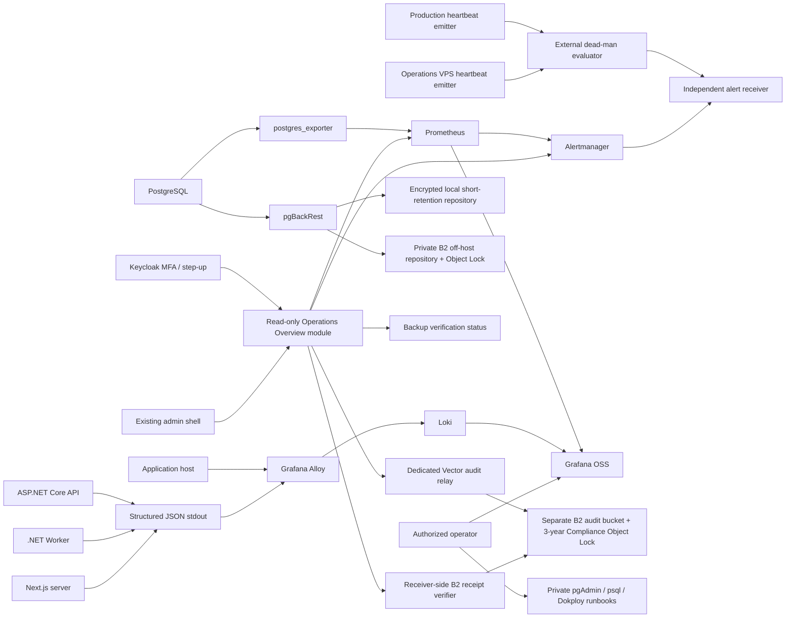

# Database Operations and Observability Plan

**Status:** Final executable architecture and operations plan; implementation not started; Production evidence pending

**Date:** 2026-07-19

**Scope:** PostgreSQL operations, application/container logging, monitoring, alerting, backup/recovery, and the read-only admin operations surface

**Software policy:** Free and open-source software only; infrastructure and storage costs remain explicit operational costs

**Validation model:** Mandatory Local Docker where feasible, mandatory end-to-end Test VPS validation for every implementation phase, and explicitly labeled safe `PRODUCTION-ONLY` evidence for live-environment claims

## 1. Decision Summary

The project will not build a database maintenance platform from scratch.

The proposed approach is:

- launch the greenfield Production environment on PostgreSQL major 18, with `18.4` as the 2026-07-19 validation baseline and no PostgreSQL 19 beta/RC in Production;
- accept a single PostgreSQL primary for V1, without high availability, only if an isolated clean-host restore proves the approved RTO;
- use a short-retention encrypted local pgBackRest repository for operational recovery and a private Backblaze B2 repository for authoritative off-host recovery;
- preserve the PITR chain during B2 interruption by keeping WAL locally and, before the approved RPO can be exceeded or `pg_wal` can fill, automatically entering one-way controlled database-write quiescence across startup, API/auth, Worker, callback, and direct database mutation paths while proven-safe reads and no-write recovery access remain available; resume is manual;
- prohibit automatic paid B2 capacity, silent retention reduction, and silent WAL loss; the 8 GB gate applies to total B2 account storage, including backup, WAL, audit, versions, and locked objects;
- exclude the existing Staging VPS from backup, identity, and Production recovery authority because it remains a non-trusted test environment;
- use that existing non-trusted Staging/Dokploy VPS as the canonical **Test VPS** for this workstream, with synthetic data and test-only credentials; it validates the complete implementation but never becomes Production authority;
- place an Operations heartbeat emitter and dedicated Vector audit relay outside Production, and place both the receiver-side dead-man evaluator and the read-only B2 audit-receipt verifier outside the Production and Operations VPS control planes; absence of this three-failure-domain design blocks Production acceptance;
- retain operational audit search in Loki for 30 days and authoritative security/admin audit in a separate B2 Object-Lock bucket for 3 years through a durable relay;
- use a single human `Owner-Operator` for V1 execution, approval, security, and incident roles; accept and record the resulting bus-factor-1/personnel-redundancy risk instead of inventing a two-person control;
- use Keycloak as the `SystemOperator` MFA/recent-auth provider; it remains a separate service and may co-reside on trusted Production infrastructure in V1, but it never becomes a dependency of database recovery;
- keep normal PostgreSQL maintenance under built-in autovacuum and infrastructure runbooks;
- use established free/open-source tools for metrics, logs, alerts, and backup/recovery;
- add a small read-only **System and Operations** area to the existing admin application;
- treat the admin page as a secondary convenience view, never as the operational source of truth;
- keep all V1 database maintenance commands outside the web application;
- keep the admin data in the existing application database; no admin-database split is approved;
- do not adopt EvLog, a custom log storage engine, a custom alert engine, or a custom backup engine;
- require a separate future decision before any web-triggered `VACUUM`, `ANALYZE`, `REINDEX`, session cancellation, or restore operation is implemented.

### 1.1 Approved Recovery Contracts - 2026-07-19

The following decisions are closed at architecture level. They are not deployment or restore evidence:

| Contract | Approved decision | Production proof still required |
|---|---|---|
| PostgreSQL and topology | Greenfield PostgreSQL 18 single primary; initial validation baseline `18.4`; restore to a clean replacement host is accepted instead of a hot standby for V1 | Dependency compatibility, digest-pinned image, clean-host PITR, and measured `RTO <= 2 hours` |
| RPO/RTO clock | `RPO <= 15 minutes`; `RTO <= 2 hours`; the clock starts at the earliest authoritative customer-impact alert or Owner-Operator incident declaration and stops only after technical recovery plus a controlled customer-facing reservation smoke and sequential self-verification | Immutable external timestamps, completed checklist, and Owner-Operator acceptance |
| Repository, immutability, and keys | Local encrypted repository for fast recovery plus private Backblaze B2 S3-compatible repository with 7-day Compliance Object Lock; Test VPS uses only separate synthetic/test repositories and has no Production authority | Test-VPS B2 compatibility/quota/Object-Lock/restore evidence plus `PRODUCTION-ONLY` actual bucket and isolated restore proof |
| Strong authentication | Self-hosted Keycloak supplies `SystemOperator` OIDC MFA/step-up evidence; B2 account administration uses provider MFA; recovery secrets remain available offline and recovery does not depend on Keycloak | Token-claim/age tests, fail-closed startup, provider MFA evidence, and offline-secret recovery drill |
| Archive continuity | `archive-async=y`, durable spool/status, `archive_timeout=60s` baseline, and no configured `archive-push-queue-max`; WAL is never acknowledged as archived unless accepted by a repository | Low-write RPO test, B2 outage/fill test, archive backlog alerts, write-quiescence and recovery proof |
| Capacity and payment | No paid B2 capacity is approved. The account-wide free allowance is 10 GB; 8 GB is the mandatory planning/blocker threshold with earlier alerts, and no silent paid-tier or retention transition is allowed | Combined backup/WAL/audit/object-version measurement, 30-day operational forecast, full 7-day recovery-window peak, full 3-year immutable-audit forecast, and provider-cap behavior |
| Independent operations | Prometheus, Alertmanager, Grafana, Loki, an Operations-VPS heartbeat emitter, and a dedicated Vector audit relay run on a minimal Operations VPS in a different provider, account, and region from Production. A receiver-side dead-man evaluator remains outside both Production and the Operations VPS/control plane | Three-failure-domain placement record, separate Production/Operations missed-check tests, and relay durability test |
| Human ownership | One `Owner-Operator` holds Product, Operations, Security, Incident, implementer, approver, and backup-owner responsibilities in V1; bus-factor-1 is an accepted limitation | Private Operations Contact Record, sequential checklist, immutable timestamps, access recovery drill, and quarterly risk review |

### 1.2 Validation Environment and Evidence Contract

The implementation follows a strict evidence ladder:

1. **Local Docker:** run every deterministic build, unit, integration, configuration, Compose, UI, simulated dependency, backup/PITR, and fault test that can be executed without real external failure-domain claims. Local co-location is acceptable only as a test fixture.
2. **Test VPS:** deploy and validate every implemented component and phase end to end on the existing non-trusted Staging/Dokploy VPS. Use synthetic data, test-only Keycloak clients/users, scoped test secrets, and dedicated B2 test buckets/prefixes. Destructive fault injection belongs here, after Local Docker passes.
3. **Production:** run only the items explicitly labeled `PRODUCTION-ONLY`, after Local and Test VPS gates pass. These items prove the real Production network, credentials, DNS/TLS, provider placement, Object Lock policy, capacity baseline, external receiver, and restore authority. Production validation must be safe, bounded, reversible where possible, and must not intentionally exhaust disk/B2, corrupt data, kill the live host, or create a customer-impacting archive outage.

Additional isolation rules are mandatory:

- destructive Test VPS tests run only in an announced exclusive maintenance window after a recoverable infrastructure/config snapshot; unrelated staging/demo workloads are stopped or moved, evidence is streamed off-host, and an explicit abort/restore limit prevents uncontrolled disk, memory, network, or B2 growth;
- Test VPS B2 buckets use distinct credentials and names. A separate non-Production B2 account is preferred when provider terms and ownership permit. If Test and Production must share an account, tests may not change account-level caps/billing controls or allocate real threshold volumes; test bytes/locked objects count in the combined 8 GB calculation and quota thresholds are simulated through fault injection;
- a Production backup restored for validation contains Production-classified data even when evidence is sanitized. The isolated restore target therefore requires encrypted storage, private ingress, default-deny egress, disabled notifications/payments/webhooks, Owner-Operator-only access, a fixed TTL, verified cleanup/volume destruction, and evidence that never contains row values;
- the Production heartbeat check isolates only a dedicated synthetic canary route/source. It does not disconnect or kill the live Production host; real provider/account/region independence is proved through placement records plus the canary alert path.

Evidence is environment-specific and cannot be promoted by wording alone:

- `LOCAL-PASS` proves code/configuration behavior only;
- `TEST-VPS-PASS` is mandatory implementation acceptance and proves deployed behavior on the test topology;
- `PRODUCTION-PASS` is required only for `PRODUCTION-ONLY` gates and proves the named live target at the recorded revision;
- every record includes environment, UTC timestamp, commit SHA, image digests, sanitized configuration hash, test/runbook ID, result, and evidence location;
- a higher environment reruns or safely revalidates applicable lower-environment behavior; it does not erase the lower-environment evidence;
- Staging/Test VPS evidence must never be presented as Production restore, Production RPO/RTO, Production capacity, or independent Production failure-domain evidence.

| Capability | Local Docker requirement | Test VPS requirement | `PRODUCTION-ONLY` requirement |
|---|---|---|---|
| Build, unit, integration, authorization, DTO, redaction, UI | Full deterministic suite | Rerun against deployed services | None beyond safe release smoke |
| Compose, private ports, service health, dashboards | Full co-located stack and config checks | Full deployed stack plus external exposure scan | Verify actual Production ingress/firewall and no public management ports |
| PostgreSQL monitor role and metrics | Real local PostgreSQL negative grants | Real Test VPS grants/load behavior | Inspect actual Production grants and bounded connection behavior |
| pgBackRest backup/PITR | Local encrypted repositories, synthetic data, restore and WAL simulation | Real B2 test bucket/prefix, synthetic data, measured restore and destructive outage/quiescence tests | Verify actual Production bucket/policy and restore Production backup into an isolated clean target |
| B2 Object Lock and capacity | Configuration/schema and simulated quota behavior | Dedicated short-retention test buckets, negative delete, quota/backlog faults | Verify actual 7-day backup and 3-year audit policies plus live combined-byte baseline/projection |
| Heartbeat and independent observability | Functional co-located pipeline only | External receiver and container/network/host-loss simulation | Prove the Operations VPS is actually in the approved different provider/account/region failure domain |
| Keycloak and `SystemOperator` | Local realm/client/claim fixtures | Test realm MFA, step-up, outage, and recovery tests | Verify actual Production issuer/client/claim mapping and fail-closed configuration |
| Vector audit, B2 receipt verification, and transactional outbox | Relay ACK, disk-buffer, retry, duplicate, redaction, remote-object receipt, and atomicity tests | Real test B2/Loki delivery, independent receipt-verifier, outage, disk-full, and break-glass tests | Verify actual immutable audit bucket, scoped relay/verifier credentials, receiver path, and safe authorized-view audit |
| WAL write quiescence | Simulated archive/status/time-to-full tests | Destructive B2-block, `pg_wal` pressure, automatic quiescence, and manual resume | Safe configuration/status proof only; no intentional live outage or disk fill |
| RPO/RTO and clean-host restore | Functional timing baseline | Full measured drill from Test VPS B2 artifacts | Isolated restore from actual Production artifacts and Production-specific smoke evidence |

No phase is accepted from Local Docker alone. No Production claim is accepted from the Test VPS alone.

## 2. Authority and Superseded Guidance

This document and `docs/20_Database_Operations_and_Observability_Implementation.md` are the canonical planning sources for this workstream.

They supersede the following older assumptions until those documents are reconciled during implementation:

- `docs/04_IDD_ENTERPRISE_FULL.md` sections 6.2 and 6.3, where a local daily `pg_dump` script is presented as the primary backup strategy;
- `docs/04_IDD_ENTERPRISE_FULL.md` section 8, where centralized observability is only a future enhancement;
- `docs/09_Implementation_Plan.md` sections 9.4 and 9.5, where backup/restore and monitoring items are marked complete without current off-host, immutable, continuously archived, restore-tested evidence;
- `docs/12_Phase10_PreLaunch_Gates.md` entries that treat cron plus `pg_dump` as sufficient disaster-recovery evidence.

This supersession does not claim those historical tasks were never performed. It means they do not satisfy the stronger recoverability and independent-observability requirements defined here.

## 3. Current-State Findings

The plan is grounded in the following repository state:

- the root Compose file uses PostgreSQL 17 while `backend/docker-compose.yml` uses PostgreSQL 18;
- the API and Worker use `Microsoft.Extensions.Logging.ILogger` and do not currently configure a centralized log backend;
- `RequestLoggingMiddleware` logs method, path, status, and duration, but does not complete its log when downstream middleware throws;
- Next.js contains direct `console.error` calls and no installed EvLog, Pino, or Winston dependency;
- the API exposes `/health`;
- admin background-job and audit endpoints currently use `SuperAdminOnly`;
- the current admin audit filter writes successful mutation audit records through fire-and-forget `Task.Run`;
- the Worker daily backup feature is disabled by default and delegates execution to a configured external command;
- no Prometheus, Alertmanager, Grafana, Loki, Alloy, `postgres_exporter`, or pgBackRest deployment is currently present in source configuration;
- the current documentation contains conflicting claims about observability and backup completion.

## 4. Goals

1. Detect database, host, API, Worker, backup, and log-pipeline degradation before it becomes a customer-facing incident.
2. Preserve searchable structured logs without storing them in the application database.
3. Establish independently recoverable PostgreSQL backups with measured restore evidence.
4. Give authorized operators a simple overview inside the existing admin shell.
5. Keep operational credentials and maintenance privileges out of the API and browser.
6. Make degraded or stale evidence explicit instead of showing an old healthy state as current.
7. Use only free/open-source software components and open protocols.
8. Keep the implementation incremental, reversible, and proportionate to one PostgreSQL-backed application.

## 5. Non-Goals

V1 will not:

- build or deploy a second custom operations frontend;
- split admin users, sessions, audit records, or settings into a second application database;
- expose raw SQL, connection strings, PostgreSQL provider errors, log-backend tokens, or backup credentials to the browser;
- add database maintenance buttons;
- terminate PostgreSQL sessions from the web application;
- execute shell commands from an API request;
- restore a database from the admin application;
- replace Grafana with custom charts or Loki with application-database log tables;
- collect arbitrary browser logs through a public ingestion endpoint;
- treat operational logs as security audit evidence;
- adopt EvLog or its early-stage .NET port;
- promise zero infrastructure cost merely because the software licenses are free.

## 6. Target Architecture



### 6.1 Placement

Application host:

- PostgreSQL;
- API, Worker, and Next.js containers;
- `postgres_exporter` with a restricted PostgreSQL monitoring identity;
- Alloy as a host-level agent, including the built-in `prometheus.exporter.unix` host-metrics component;
- only the bounded read-only host filesystem, procfs, and sysfs mounts required by the approved Alloy collectors; privileged mode and extra capabilities remain disabled unless separately justified and reviewed;
- pgBackRest client/stanza configuration;
- a bounded local pgBackRest repository on a dedicated path/quota; this repository is operational convenience and is not disaster-recovery authority.

Trusted Production identity service:

- Keycloak runs as a separate service with a separate database/role and separate credentials;
- V1 may place it on the new trusted Production infrastructure to avoid another host cost;
- it is used only for `SystemOperator` strong authentication, so its failure does not affect public reservations or ordinary business authentication;
- database recovery uses offline infrastructure credentials and does not depend on Keycloak availability.

Independent monitoring location:

- Prometheus;
- Alertmanager;
- Grafana OSS;
- Loki;
- an Operations-VPS heartbeat emitter;
- a dedicated Vector audit relay with a bounded blocking disk buffer.

The target Operations failure domain is a minimal VPS in a different provider, account, and region from Production, with separate network, disk, deployment path, and credentials. It must not share the Production database, host disk, B2 account-master credential, DNS/control-plane dependency, or deployment control path. A same-provider design requires a later documented exception proving separate account, region, network, billing/control plane, and failure tests; same-host and same-account placement are never accepted. If a qualifying host cannot be supplied without new cost, Production acceptance stays blocked until the Owner-Operator explicitly approves that infrastructure cost or supplies a host; software remains free/open source.

Heartbeat evaluation is a third failure domain, not an Alertmanager rule on the Operations VPS. Separate synthetic emitters on Production and the Operations VPS report to a receiver-side dead-man evaluator hosted in an account/control plane that depends on neither host. Missing Production emissions page on Production loss; missing Operations emissions page on monitoring-host loss. The evaluator and notification receiver must remain reachable when either or both managed VPS workloads are unavailable, and they must not share the Operations deployment credentials.

The same receiver-side control plane hosts a minimal audit-receipt verifier, but the verifier is not an audit relay or a new authoritative store. It uses a separate read-only B2 list/get-version identity, observes the accepted remote object version, verifies the stable event ID and event digest inside that object, and returns a short-lived signed receipt containing the event ID, object key, version/file ID, digest, and verification time. The B2 object version remains authoritative. Neither Vector source acknowledgement, Vector sink finalization, the Operations-VPS disk buffer, Loki, nor the receipt cache may independently create `B2_DELIVERED`. Verifier or receipt-path failure therefore reduces overview availability and fails closed; it cannot silently upgrade a submitted or locally buffered event to delivered.

Independent backup location:

- private Backblaze B2 S3-compatible bucket dedicated to pgBackRest;
- 7-day default Compliance Object Lock for the approved repository prefix/bucket;
- pgBackRest repository encryption in addition to provider transport/storage controls;
- authoritative recovery copies of the repository cipher passphrase and B2 credentials stored outside both the database host and backup dataset;
- an independent read/list/download-by-file-ID recovery identity and signed accepted-version manifest outside the runtime host. For every accepted B2 chain, the manifest records each required object name, B2 file/version ID, digest, lock expiry, repository generation, and backup label, including pgBackRest metadata objects;
- version-aware verification that alerts critically on a hide marker, unplanned same-name version, current-version absence, or digest/file-ID drift. Object Lock protects accepted historical versions but does not guarantee that download-by-name still resolves to them;
- a recovery procedure that never asks pgBackRest to select a historical B2 version directly. It downloads the manifest-pinned historical versions by file ID, verifies their digests, materializes a clean isolated repository/prefix without modifying the original bucket, and runs pgBackRest restore against that reconstructed repository.

Independent audit location:

- a separate private B2 bucket dedicated to security/admin audit, not the pgBackRest repository;
- 3-year Compliance Object Lock for accepted audit objects;
- a bucket/prefix-scoped runtime credential held only by the Operations audit relay, excluding `deleteFiles`, retention/legal-hold mutation, governance bypass, and bucket/account administration;
- a distinct receiver-side live receipt-verifier identity limited to read/list/get-version on the audit bucket, with no upload/delete/retention/bucket administration capability and no access to the relay credential;
- unique never-reused object names plus a third offline/read-only governance-verification identity that inventories object versions/file IDs and detects hide markers, missing current versions, receipt-verifier drift, and lifecycle drift because B2 upload capability can still create name-hiding versions;
- a bounded persistent relay queue whose backlog and delivery age are independently alerted;
- a separately measured audit budget included in the same account-wide 8 GB capacity decision.

The existing Staging VPS is the canonical Test VPS. It is never an authoritative Production monitoring, identity, backup, restore, or recovery-secret location. It may be rebuilt or destroyed without affecting Production recovery, and it uses only synthetic data and test-scoped credentials.

Running everything on one Docker host is required where feasible for Local Docker validation and acceptable on the Test VPS for functional/fault testing. Neither topology is independent Production evidence because a shared host outage can remove the application and monitoring together.

## 7. Open-Source Component Decisions

| Capability | Approved component | Role | Explicit limit |
|---|---|---|---|
| Normal database maintenance | PostgreSQL autovacuum/autoanalyze | Routine tuple cleanup and statistics maintenance | Must be monitored and tuned per relation; not replaced by cron-driven blanket vacuum |
| PostgreSQL metrics | `postgres_exporter` | Expose bounded PostgreSQL metrics | Uses `pg_monitor`/least privilege, never superuser in the approved design |
| Metrics and rules | Prometheus | Time-series storage and rule evaluation | Not publicly exposed; V1 retention is 30 days |
| Alert routing | Alertmanager | Deduplicate, group, inhibit, and route alerts | Requires an independently reachable receiver and tested delivery |
| Visualization | Grafana OSS | Query Prometheus and Loki | Not the source of truth; it is a view over external stores |
| Host metrics plus host/container/app log collection | Grafana Alloy | Collect host metrics with `prometheus.exporter.unix` and forward bounded logs/telemetry | Disable collectors that require elevated privileges; use minimum read-only host mounts; raw Docker socket access is prohibited unless mediated by a restricted proxy |
| Log storage/search | Loki | Operational log retention and query | Not a tamper-proof security audit store |
| Audit relay | Dedicated Vector relay | Authenticated HTTP ingestion, bounded blocking disk buffer, retry, event-addressable S3 partitioning, and S3-compatible delivery | Vector exposes no V1 application audit state: source response, disk-buffer persistence, sink finalization, and S3 request success are internal pipeline outcomes and never create authoritative per-event `B2_DELIVERED` |
| Audit delivery receipt | Receiver-side B2 receipt verifier | Read-only remote object/version observation plus event-ID/digest verification and a short-lived signed status receipt | Normal overview disclosure waits for this B2-derived receipt; verifier/cache state is not a second authoritative audit store |
| Authoritative audit storage | Separate private B2 bucket with 3-year Compliance Object Lock | Off-host immutable security/admin audit evidence | Counts against the same account-wide free allowance and is not an interactive query engine |
| Backup and PITR | pgBackRest | Full/differential/incremental backup plus WAL archive | Backup success is incomplete until isolated restore verification passes |
| Off-host backup infrastructure | Backblaze B2 managed S3-compatible object storage | Private remote repository with provider Object Lock | Approved infrastructure exception, not an open-source software component; free 10 GB allowance and 8 GB planning gate are hard constraints |
| Operator identity | Keycloak | OIDC MFA and step-up/recent-auth evidence for `SystemOperator` | Separate service; not a recovery dependency; Test VPS uses a test realm/client, while the Production issuer/credentials may never be placed there |
| Exceptional DBA access | `psql` and optional pgAdmin | Manual runbook-driven intervention | Private network only; no public route and no ordinary admin access |

Alternatives such as Percona PMM, Barman, WAL-G, VictoriaMetrics, Thanos, or OpenSearch may be evaluated later, but no additional platform is approved unless a measured requirement exceeds this stack.

## 8. Operational Source of Truth

The admin page is not authoritative.

Authoritative operational evidence is:

- Prometheus for current and recent metrics;
- Alertmanager for active alert state and delivery status;
- Loki for operational logs;
- pgBackRest repository metadata plus restore-verification reports for backup/recovery;
- direct PostgreSQL, Dokploy, host, or private pgAdmin/`psql` evidence during incident response.

The admin page is a read-only projection. Every section must include:

- source name;
- source timestamp;
- retrieval timestamp;
- evidence age;
- status reason;
- link to the authoritative external view or runbook.

Supported display states are:

- `HEALTHY`: fresh evidence and no active threshold breach;
- `WARNING`: fresh evidence with a non-critical threshold breach;
- `CRITICAL`: fresh evidence with a critical threshold breach;
- `STALE`: the last successful evidence is older than the allowed age;
- `UNTRUSTED`: the source or delivery pipeline is inconsistent or unhealthy;
- `UNKNOWN`: no usable evidence has ever been collected.

The page must never fall back from `STALE`, `UNTRUSTED`, or `UNKNOWN` to a previously cached green state.

## 9. Deep Module and Interface

The application-owned seam is a deep **Operations Overview module**. Its external interface is intentionally small:

```csharp
public interface IOperationsOverviewReader
{
    Task<OperationsOverview> GetOverviewAsync(CancellationToken cancellationToken);
}
```

The caller must not know PromQL, Loki queries, pgBackRest JSON, Alertmanager routes, storage layout, or provider-specific error shapes.

The module implementation owns:

- parallel bounded reads from approved external sources;
- per-source timeout and circuit-breaker behavior;
- normalization into stable status categories;
- partial-success behavior;
- short in-memory caching;
- stale/untrusted classification;
- removal of internal URLs, tokens, raw queries, and provider errors;
- mapping to a single read-only DTO.

True external dependencies are represented by internal ports with Production HTTP/status adapters and in-memory test adapters. These ports remain internal to the module implementation and are not exposed to controllers or frontend callers.

## 10. Logging Strategy

### 10.1 Backend and Worker

The API and Worker keep `Microsoft.Extensions.Logging.ILogger` and add the built-in JSON console provider.

Required fields:

- UTC timestamp;
- severity;
- service and environment;
- deployment version/commit when available;
- correlation ID and trace ID;
- event ID/name;
- route template rather than unbounded raw URL where possible;
- duration and outcome;
- bounded domain identifiers only when operationally necessary.

Forbidden by default:

- authorization/cookie headers;
- access/refresh/reset tokens;
- passwords and provider secrets;
- request/response bodies;
- payment payloads;
- customer names, emails, phone numbers, identity/passport data, addresses, notes, or exact delivery coordinates;
- raw SQL and bind values;
- full query strings;
- serialized controller responses.

`RequestLoggingMiddleware` must log completion in a `finally`-safe design and record a safe failure outcome without duplicating exception details already handled by the exception middleware.

### 10.2 Next.js

V1 uses Next.js `instrumentation.ts`/`onRequestError` and sanitized structured server-side stdout. No EvLog, Pino, Winston, or public browser-log ingestion endpoint is added.

Client error boundaries remain user-experience controls. A later client telemetry endpoint requires a separate abuse, schema-validation, rate-limit, payload-size, privacy, and retention decision.

### 10.3 Audit Is Separate

Operational logs may be sampled or dropped and therefore are not authoritative security audit evidence.

Security-critical audit requires durable delivery semantics. The current fire-and-forget audit filter is not sufficient and must not be reused for the operations surface.

The V1 audit contract is:

- Loki retains a searchable operational copy for 30 days, but it is never the authoritative security audit sink;
- the authoritative sink is a separate private B2 audit bucket with 3-year Compliance Object Lock;
- the API assigns a stable event ID, canonical digest, and opaque event partition derived as `SHA-256(event ID)`, then sends the bounded sanitized event to a dedicated Vector relay using authenticated private TLS; neither overview reads nor their audit records write to `RentACarDbContext`;
- Vector has no application-visible intermediate durability state in V1. Its HTTP/source response, disk buffer, end-to-end acknowledgement, sink finalization, and S3 request result are internal pipeline outcomes only; no fsync-backed application acknowledgement is claimed or tested;
- Vector end-to-end acknowledgement, sink finalization, or successful S3 request handling is pipeline evidence, not an application-consumable per-event B2 receipt, and therefore can never by itself produce `B2_DELIVERED`;
- Vector writes exactly one audit event per object under the deterministic bounded prefix `audit/v1/event=<opaque-partition>/` with a unique never-reused suffix. The receipt verifier derives that prefix from the requested event ID, lists only that prefix with a strict result/version bound, and verifies the event ID and digest inside the object; it never scans the bucket or accepts caller-supplied object coordinates;
- the receiver-side receipt verifier uses its separate read-only B2 identity to observe the immutable remote object version, parse and match the stable event ID and digest, and issue a short-lived signed receipt containing the B2 object key, version/file ID, digest, and verification timestamp. Only successful validation of that receipt creates application state `B2_DELIVERED`; Loki and local/relay caches never satisfy it;
- the API polls the authenticated receipt-status endpoint by event ID within the bounded request deadline; it does not use a B2 SDK or accept caller-supplied object coordinates. Missing, stale, malformed, mismatched, replayed, or unverifiable receipts fail closed and raise `AUDIT_DEGRADED`;
- normal overview data is disclosed only after receipt-derived `B2_DELIVERED`. Submission without a valid B2-derived receipt becomes `AUDIT_DEGRADED`, raises a critical alert, and fails closed for new normal overview reads; no Operations-VPS disk, Vector acknowledgement, or receipt-cache-only result is represented as off-host audit completion;
- if the relay, B2, or receipt verifier cannot confirm the required state within the bounded request deadline, normal overview access fails closed and a retry reuses the stable event ID. Vector may retain/retry an accepted event internally, but the plan makes no queued/durable claim until the B2-derived receipt exists;
- break-glass overview access is permitted only with MFA/recent authentication, a recorded incident ID, immutable external timestamp, and export disabled; the missing audit delivery becomes a critical incident until reconciled;
- `SystemOperator` grant/revoke and any future control-plane mutation require confirmed off-host audit acceptance and have no fail-open path.

Existing security-critical business mutations must replace the fire-and-forget audit filter with a transactional outbox written in the same database transaction as the business change, then delivered through the same relay. That outbox is not used by the read-only overview and does not make the application database the authoritative audit sink.

Audit events contain only event ID, UTC timestamps, actor subject hash or stable non-PII identifier, action, outcome, safe reason code, correlation/incident ID, source service, and integrity metadata. Delivery is at least once: repeated copies keep the same event ID and evidence queries deduplicate by that ID; the design makes no exactly-once claim. Tokens, response bodies, raw queries, customer data, credentials, and provider messages are prohibited.

## 11. Metrics and Alerting

### 11.1 Initial Metrics

- API availability, request duration, and 5xx rate;
- Worker heartbeat and queue depth;
- PostgreSQL availability and connection utilization;
- transaction and idle-in-transaction age;
- relation dead tuples and autovacuum/analyze age;
- database and relation growth;
- lock waits and long-running queries without query text/bind values;
- XID age relative to freeze limit;
- host disk, memory, CPU, and filesystem pressure;
- Alloy, Prometheus, Loki, and Alertmanager self-health;
- last successful backup, WAL archive freshness, last verification, and last isolated restore test.

### 11.2 Initial Thresholds

Thresholds are starting values and must be tuned after a 14-day baseline:

| Signal | Warning | Critical |
|---|---:|---:|
| Monitoring heartbeat age | 2 minutes | 3 minutes |
| Off-host WAL archive age | >5 minutes | >10 minutes; watcher target 14 minutes and hard quiescence before 15 minutes |
| Estimated `pg_wal` time to full | <=30 minutes | <=15 minutes; quiesce immediately |
| Audit relay oldest not-`B2_DELIVERED` event | >5 minutes | >15 minutes or authoritative B2-derived receipt unavailable |
| PostgreSQL connection utilization | >70% for 5 minutes | >85% for 5 minutes |
| Transaction age | >5 minutes | >15 minutes |
| Idle-in-transaction age | >2 minutes | >5 minutes |
| Free disk | <20% | <10% |
| XID age | >50% of freeze limit | >75% of freeze limit |
| Last successful off-host backup | >20 hours | >26 hours |
| Last successful restore verification | >35 days | >45 days |
| API 5xx rate | baseline plus agreed threshold | sustained customer impact |

Dead tuples and autovacuum signals must be evaluated per relation and with statistics-reset context. Index-removal advice requires at least 30 days of evidence since the latest statistics reset and remains advisory only.

Every alert must define:

- severity and owner;
- consecutive-sample/`for` duration;
- deduplication and cooldown behavior;
- external receiver;
- runbook URL;
- recovery notification;
- test procedure.

Alertmanager performs no automatic remediation. The sole V1 automatic safety action is a local, infrastructure-owned write-safety watcher moving all database mutation paths to `WRITE_QUIESCED` at the approved WAL/audit durability boundary. It cannot enable writes, delete data, alter retention, purchase capacity, run SQL, or execute recovery. Resume always requires the Owner-Operator checklist.

## 12. Backup and Recovery

The Worker `DailyBackup` job is not the disaster-recovery authority.

The approved target is:

- fixed pgBackRest repository identities (`repo1` local and `repo2` B2), with full/differential/incremental backup, expire, check/info evidence, and restore verification scheduled and recorded separately for each repository; WAL `archive-push` fans out to every configured repository but never substitutes for a repository-specific base-backup schedule;
- continuous WAL archiving for point-in-time recovery;
- repository encryption;
- a private Backblaze B2 off-host repository reached through its S3-compatible endpoint;
- 7-day Compliance Object Lock, configured before accepted backup data is written;
- a bucket/prefix-scoped runtime application key with only the operations pgBackRest requires; B2 account/master credentials and Object Lock administration credentials are not present on the Production host;
- checksums and repository verification;
- monthly isolated restore verification on the same PostgreSQL major version;
- quarterly documented disaster-recovery exercise;
- measured recovery time and recovery point evidence.

Approved initial objectives:

- **RPO:** no more than 15 minutes;
- **RTO:** no more than 2 hours;
- **Local repository:** at least two complete recoverable full chains with the differential/incremental backups and WAL required by policy, bounded by a dedicated quota;
- **B2 repository:** every chain and WAL segment required for every target in the rolling 7-day PITR window, with at least two overlapping full chains under the weekly-full cadence and an oldest-in-window restore after expiration evaluation, protected by 7-day Compliance Object Lock;
- **B2 capacity:** 10 GB provider free allowance, 8 GB operational planning ceiling; exceeding the combined 7-day recovery-window or 3-year immutable-audit forecast is a recovery blocker even when the 30-day operational forecast is green, never an automatic paid-tier transition;
- **Evidence retention:** restore-verification reports for at least 13 months; backup retention may be increased only after measured capacity shows that the free allowance and safety margin remain satisfied.

The single-primary topology is explicitly disaster recovery, not high availability. A PostgreSQL process, disk, or host loss causes downtime. It is accepted for V1 only while the clean replacement-host restore drill remains within the two-hour RTO; otherwise a standby or additional trusted recovery infrastructure becomes a Production blocker.

### 12.1 WAL Archive Interruption and Write-Quiescence Contract

The approved priority is to preserve both database integrity and the declared PITR/RPO contract. PostgreSQL stays online for proven-safe reads and operational recovery, but no application/startup/auth/Worker database mutation continues past the point where its WAL cannot be protected within the 15-minute RPO.

- Configure `archive-async=y` with a durable pgBackRest spool/status path and `archive_timeout=60s` as the initial low-write baseline. A later increase is allowed only when the low-write acceptance test still proves `RPO <= 15 minutes`.
- `archive-push-queue-max` must remain unset. A finite value can allow queued WAL to be dropped/acknowledged under pressure and would silently break the PITR chain.
- Mark `DEGRADED` immediately on confirmed B2 archive failure, but never start the RPO safety clock at failure confirmation. The watcher computes conservative `oldest_unprotected_wal_age` from local archive/spool state and reserves a maximum two-minute uncertainty budget covering `archive_timeout=60s`, archive-command timeout/retry, and polling/detection. It warns at 5 minutes, pages at 10 minutes, and quiesces every database mutation path when the computed age reaches 13 minutes, when the remaining verified margin is one minute or less, or earlier when predicted `pg_wal` exhaustion is 15 minutes or less. Unknown/regressed age fails safe immediately. Tests must prove the hard stop occurs before the oldest unprotected commit can reach 15 minutes.
- The watcher publishes one atomic, short-TTL, infrastructure-owned write-admission state on the Production host. API and Worker receive it read-only; stale/invalid state fails safe for every database mutation. It is a narrow safety controller, not an Alertmanager webhook or general command runner.
- Quiescence uses one centralized write-admission contract across startup initialization, API business mutations, authentication/session/account writes, internal callbacks, direct database command paths, and Worker jobs. Request middleware is only one enforcement layer; it is never the sole gate, and controller-specific flags are prohibited.
- Production reads the state before `InitializeApiAsync` can run migrations or seeds. While quiesced, automatic migrations and all seeders are skipped/refused without touching PostgreSQL. The API may start in read/recovery-only mode only after a no-write schema-compatibility preflight succeeds; otherwise startup fails closed without a database write.
- Existing login, refresh, logout, password/account, session rotation/revocation, failed-attempt counter, and last-seen paths are treated as writes and are denied while quiesced. Recovery authentication uses a pre-existing offline/private-host credential or already-valid non-rotating credential that can be verified without database mutation; it cannot refresh, seed, create, revoke, or update a session.
- Greenfield schema bootstrap is not a quiescence bypass. PostgreSQL, pgBackRest, every repository's WAL path, capacity evidence, and the watcher must be healthy first; public ingress and Worker remain disabled; then the Owner-Operator may use the same audited manual gate for one bounded `INITIAL_SCHEMA_BOOTSTRAP` window tied to a change ID. The gate is disabled again after migration/required seed evidence and before final cutover checks. This mode is unavailable whenever WAL/B2 evidence is degraded, stale, unknown, or quiesced by the watcher.
- Health, monitoring, recovery access through that no-write credential, and safe reads remain available. No automatic WAL deletion, archive disablement, retention shrink, or paid-capacity purchase is permitted.
- Writes resume only after B2 accepts the entire backlog, repository/WAL checks show no gap, current archive age is within policy, capacity projection is below the 8 GB blocker, and the Owner-Operator completes the timestamped resume checklist.

### 12.2 Recovery Clock Contract

The RTO clock starts at the earliest timestamp of:

1. an external alert proving that PostgreSQL loss/corruption prevents a customer-facing reservation read or committed write; or
2. the Owner-Operator, acting as Incident Commander, declaring that PostgreSQL recovery is required.

The clock never starts later merely because the alert or incident declaration was delayed. The earlier timestamp is authoritative.

The RTO clock stops only after all of the following are timestamped:

1. PostgreSQL 18 is restored/promoted on the approved clean target and the replay target is recorded;
2. database, API, Worker, and public HTTPS health checks pass from outside the recovered host;
3. a controlled synthetic customer flow completes availability lookup, creates and reads a non-payment recovery-test reservation with notifications disabled, and confirms the record from the authorized admin path;
4. the Owner-Operator completes a sequential self-verification checklist, records immutable external timestamps, and signs the smoke evidence in both the Incident and Product-owner roles.

This is not independent human approval. It is an explicit compensating control for the accepted single-operator model and must not be described as two-person review.

Database startup, a green container health check, or successful SQL connectivity alone does not stop the clock. RPO is measured from the latest committed business record recovered against an authoritative pre-impact watermark, not only from WAL archive age. For drills, the watermark is a side-effect-disabled synthetic reservation/recovery probe with a stable non-PII ID, committed UTC timestamp, and independent receiver timestamp recorded before fault injection. After restore, the same ID and database commit time are compared with the external receipt. During a real incident, only a pre-existing independently timestamped business acknowledgement may substitute; if none exists, RPO evidence is `UNVERIFIED` and cannot pass the recovery gate.

A backup status is never a boolean. The overview reports:

- `SUCCESS`;
- `STALE`;
- `FAILED`;
- `UNVERIFIED`;
- `UNKNOWN`.

`SUCCESS` requires both fresh backup/WAL evidence and a restore verification that is still within policy.

## 13. Admin Experience

The existing admin shell receives a top-level `System and Operations` route, proposed as `/dashboard/operations`.

V1 displays:

- overall state and evidence freshness;
- API, Worker, PostgreSQL, monitoring-pipeline, log-pipeline, and backup summaries;
- active critical/warning alert counts;
- last successful backup and restore verification;
- bounded capacity trends;
- failed/pending background-job counts;
- links to Grafana, approved log queries, Dokploy, and runbooks.

V1 does not display:

- raw application logs;
- full SQL/query text;
- credentials or infrastructure configuration;
- maintenance controls;
- session-kill controls;
- backup-restore controls.

## 14. Authentication, Authorization, and Credential Isolation

`Admin` or `SuperAdmin` alone does not imply operations access.

The target policy is `SystemOperatorOnly`, backed by Keycloak OIDC and a separate `SystemOperator` membership:

- membership is configured in Keycloak/infrastructure using immutable admin subject IDs;
- ordinary admin users cannot grant, revoke, or self-assign membership;
- grant/revoke changes produce off-host audit evidence;
- Production access requires Keycloak MFA plus an approved step-up level (`acr`/LoA mapping) and authentication no older than 10 minutes;
- the API validates the required claim/level and authentication age instead of trusting frontend navigation or a default client login level;
- the feature fails closed in Production when the strong-auth requirement is not configured;
- tests must prove that developer bypass settings cannot enable the feature in Production.

In V1 the Owner-Operator is the only authorized human grant/revoke administrator and incident contact. The public repository records only the role name. The real name, primary/backup contact channels, offline-secret custody location by name, and after-hours expectation are maintained in a private, versioned Operations Contact Record. “Backup owner” means the same person's alternate contact and recovery path; it does not imply a second human.

Credential rules:

- `postgres_exporter` receives a dedicated login with `pg_monitor` or narrower grants, a connection limit, and fixed timeout settings;
- the API never receives the PostgreSQL monitor or maintenance password;
- the API receives only read-only credentials/tokens for approved monitoring status endpoints;
- pgBackRest repository secrets remain infrastructure-only;
- the pgBackRest cipher passphrase and bucket-scoped B2 application key are injected from the Production secret store at runtime and are never committed, logged, or returned;
- an encrypted KeePassXC recovery database, protected by a separately held master secret and stored on the owner-controlled workstation plus one offline removable copy, is the authoritative out-of-host recovery copy;
- the B2 account/master credential and Object Lock administration capability are absent from Production; the B2 account requires provider MFA;
- Prometheus, Loki, Alertmanager, Grafana, exporters, and pgAdmin are not exposed publicly;
- browser responses never contain internal base URLs or tokens;
- all configured external base URLs are deployment-owned allowlisted values, never request parameters;
- outbound HTTP clients use TLS where crossing a host boundary, strict timeouts, response-size limits, and no redirects to untrusted hosts.

The V1 design explicitly does not resist full API host/code-execution or signing-key compromise. If independence from that compromise is required, a separate control plane with separate deployment, authentication, secrets, audit sink, and datastore becomes mandatory.

## 15. Retention and Capacity

Approved initial technical policy; legal/business retention still requires owner approval where noted:

- Prometheus high-resolution metrics: 30 days;
- Loki operational logs: 30 days;
- security/admin audit: authoritative B2 audit objects for 3 years under Compliance Object Lock plus a 30-day searchable Loki copy;
- local backup repository: at least two complete recoverable full chains, bounded by a dedicated filesystem quota;
- total B2 account: backup, WAL, audit, versions, and locked objects share an 8 GB operational ceiling inside the 10 GB free allowance; the pgBackRest repository retains every full/differential/incremental backup and WAL segment required to restore any point in the rolling 7-day PITR window. With weekly full backups this requires at least two overlapping full chains, plus transition overlap until the oldest in-window restore succeeds;
- restore-verification reports: at least 13 months;
- alert history: 13 months when storage allows, otherwise external incident records preserve material events.

Every store requires:

- a size quota or bounded retention;
- storage-pressure alerting;
- deletion and legal-hold procedure;
- documented owner;
- periodic capacity review.

Manual dashboard checking is not the capacity control. Automated measurements and alerts are mandatory:

- total B2 account stored bytes, including backup, WAL, audit, versions, and locked objects: informational at 6 GB, warning at 7.5 GB, capacity-decision blocker at 8 GB, and critical at 9 GB;
- B2 provider caps/alerts and an infrastructure-owned repository-usage metric are both required; no B2 administrative credential is exposed to the application overview;
- PostgreSQL data/WAL/local-repository filesystem: warning at 70% and critical at 85%, with the local repository unable to consume PostgreSQL's reserved free-space margin;
- before Production acceptance, record `pg_database_size`, daily WAL generation, compressed full/differential backup size, total and per-bucket B2 stored bytes, audit bytes/day, locked/versioned object overhead, log bytes/day, Prometheus active series, and metrics bytes/day;
- maintain a 30-day operational growth forecast for early intervention, but Production acceptance uses retention-horizon forecasts: the peak backup/WAL/version footprint across the full rolling 7-day PITR window and chain overlap, plus the cumulative audit/locked/version overhead through the full 3-year immutable retention horizon. The combined conservative peak must remain below 8 GB;
- if any retention-horizon forecast exceeds 8 GB, Production acceptance is blocked even when the 30-day forecast is green. Retention may not be shortened below the approved recovery/audit contracts; use the fixed no-paid exit order below;
- backup, WAL, or audit upload failure caused by quota is a critical incident, not a reason to delete locked evidence, silently reduce retention, enable payment, or disable archiving; if WAL cannot be protected within RPO, controlled write quiescence is mandatory.

The no-paid-capacity exit order is fixed:

1. reconcile provider and internal byte measurements, including versions and locked objects;
2. allow only already-approved retention-compliant expiration and remove optional non-authoritative data outside the protected recovery/audit minima;
3. if usage/projection cannot return below 8 GB, provision and isolated-restore-test a separately approved off-host repository before moving recovery authority;
4. if no verified off-host authority can accept WAL/audit before the RPO or local durable queues are exhausted, keep only proven-safe reads/no-write recovery access available and quiesce every database mutation path.

A second repository is not accepted merely because it exists. It becomes an exit path only after encryption, immutability, credential isolation, continuous WAL, full-chain restore, capacity monitoring, and independent failure-domain tests pass. Paid B2 capacity remains outside V1 until a later explicit decision changes this contract.

Long-term metrics backends such as Thanos, Mimir, or VictoriaMetrics are not approved in V1. They require a measured need beyond Prometheus's initial retention.

## 16. Degraded-Mode Contract

The operations feature must not become a dependency of reservations, payments, authentication, or public-page traffic during normal operation.

The local write-safety state is the deliberate exception for every database mutation path: it may deny writes to preserve WAL/audit durability, but it never sits on public reads, health, or the explicitly defined no-write recovery-auth path. Ordinary login, refresh, logout, session/account mutation, counters, and last-seen updates are not exempt; section 12.1 requires them to quiesce. Only validation of an already-valid non-rotating credential or offline/private-host recovery credential that performs no database write remains available.

- Monitoring-source calls occur only on authorized operations requests or background refreshes.
- Each source has a strict timeout and independent circuit breaker.
- Partial source failure returns partial data with explicit `STALE`, `UNTRUSTED`, or `UNKNOWN` status.
- Monitoring failure never blocks or slows business requests.
- No status response writes to the application database.
- The overview response is `Cache-Control: no-store` even if the module uses a short internal cache.
- If the API is unavailable, the operator uses Grafana, Alertmanager, Dokploy, private PostgreSQL tools, and backup runbooks directly.
- Operations overview access follows the audit acknowledgement/fail-closed/break-glass contract in section 10.3; audit delivery failure never blocks public reads or already-authorized business requests that require no new database write, while the independent WAL write-safety state may separately quiesce all mutating business/auth paths.

## 17. Free/Open-Source Software Policy

Approved components must have an OSI-compatible or otherwise repository-approved open-source license and no required paid control plane.

The following are prohibited in the base design:

- required Axiom, Datadog, Better Stack, Sentry SaaS, Grafana Cloud, or other paid log/metrics adapters;
- a feature whose Production correctness depends on an unmonitored free trial or limited commercial entitlement without a hard capacity gate and failure contract;
- unreviewed `latest` container tags;
- silently switching to a paid tier when retention grows.

Container images must be version-pinned and, after validation, digest-pinned. Dependencies and images remain subject to the repository's existing vulnerability and update workflow.

Free software does not imply free infrastructure. Separate hosts, object storage, bandwidth, email delivery, and disk capacity must be budgeted. If independent infrastructure is unavailable, the resulting limitation must be recorded and the deployment must not be described as independently observable or disaster-recoverable.

Backblaze B2 is an explicitly approved managed-infrastructure exception for the initial zero-additional-cost deployment. The exception is valid only while the current provider terms still include the 10 GB free allowance, combined account usage remains below the 8 GB operational ceiling, provider spend/data controls and internal alerts work, Object Lock is verified, and isolated restore evidence is current. Paid B2 capacity is not an approved exit path. If any condition fails, Production/off-host recovery acceptance becomes blocked; the system must not purchase capacity, reduce required retention, or claim compliant DR from only the local repository.

## 18. Security Plan Gap Report

The following are planning gaps found in the legacy design and closed by requirements in this document. They are requirement gaps, not claims of confirmed exploitable vulnerabilities.

| ID | Severity | Confidence | Stage / Stack | Evidence | Risk and failure scenario | Required plan addition | Verification |
|---|---|---|---|---|---|---|---|
| `ops-monitor-credential-isolation` | High | High | Plan / ASP.NET Core | Legacy design did not define separate monitoring credentials | API compromise could become direct database-inspection or maintenance compromise | Dedicated `pg_monitor` login; no monitor/maintenance secret in API; private exporter network | Inspect grants, container secrets, network exposure, and negative API configuration tests |
| `ops-admin-authz` | High | High | Plan / ASP.NET Core | Current operational endpoints use `SuperAdminOnly`; no `SystemOperator` policy exists | A broad business-admin role could gain infrastructure visibility or future operational power | Separate claim, infrastructure-controlled membership, MFA/recent-auth, fail-closed Production configuration | Authorization matrix tests and Production startup-failure tests |
| `ops-sensitive-log-data` | High | High | Plan / ASP.NET Core + Node web | Existing docs do not define a complete PII/secret logging contract | Customer, token, payment, or identity data could enter Loki and backups | Explicit forbidden fields, structured schema, redaction tests, no body/header/query capture | Unit tests with canary secrets/PII plus Loki query showing no leakage |
| `ops-audit-durability` | High | High | Plan / ASP.NET Core | Current audit filter uses fire-and-forget execution; Vector has no distinct application-visible fsync-buffer ACK; and a batched random object key cannot support bounded event receipt lookup | Process, sink, or receipt-path failure can lose evidence, falsely promote submission to durability, or cause unbounded bucket scans | Vector remains an internal buffered pipeline with no intermediate application audit state; one event per object under a SHA-256 event partition; `B2_DELIVERED` only from a bounded receiver-side verifier that matches remote object version, event ID, and digest; fail-closed normal reads; 30-day Loki copy; 3-year Object-Lock bucket | Submission/restart/backlog/quota/hide-marker/verifier-outage/receipt-replay/prefix-overflow tests prove event-addressable B2-derived receipts, at-least-once duplicate tolerance, fail-closed normal access, and bounded break-glass |
| `ops-backup-recoverability` | High | High | Plan / Common web | A single unqualified schedule can leave B2 without a base chain, while B2 same-name versions or hide markers can shadow locked historical objects that pgBackRest reads by repository key | Host loss, repository-selection drift, or a malicious/corrupt current version can make direct off-host restore fail even though protected history exists | Fixed `repo1`/`repo2`; per-repository schedules/evidence; all-repository WAL; signed object-name-to-file-ID/digest manifest; version-drift alerts; clean repository reconstruction from historical file IDs; independent-host restore | Direct and manifest-reconstructed B2 restores after same-name/hide faults, explicit repository inventory/check/expire evidence, oldest-in-window restore, and quarterly DR report |
| `ops-quiescence-write-coverage` | High | High | Plan / ASP.NET Core | Middleware-only write control does not cover startup migrations/seeds, auth/session writes, direct DB commands, or every Worker/internal mutation | Restart or recovery authentication during B2/WAL failure can continue generating unprotected WAL after the hard stop | One infrastructure-owned state consumed before startup initialization and by a centralized write-admission contract across API, auth, callbacks, database mutation services, and Worker; no-write recovery authentication; read/recovery-only startup only after schema compatibility proof | Endpoint/job/startup inventory tests, quiesced restart, migration/seed/auth negative tests, direct-write negative tests, and gap-free resume proof |
| `ops-free-tier-capacity` | High | High | Plan / Common web | Backup, WAL, audit, versions, and locked objects share a 10 GB account allowance and cannot be controlled by manual dashboard checks | Account growth can reject WAL/audit, stop archival, or create an unexpected bill while a short forecast remains green | No-payment/no-auto-upgrade policy, combined-account 6/7.5/8/9 GB gates, 30-day operational forecast, 7-day recovery-window peak, 3-year immutable-audit forecast, `archive-push-queue-max` prohibition, and controlled write quiescence | Retention-horizon forecast proof, fill/quota/B2-outage tests, account reconciliation, no-WAL-gap proof, and oldest-in-window restore |
| `ops-recovery-secret-custody` | High | High | Plan / Common web | Host loss or unsafe rotation removes runtime B2/repository-encryption secrets, while the single human owner is also the only custodian | Off-host backups can become undecryptable after host loss, owner unavailability, or retirement of a still-required key | Runtime bucket-scoped keys only; account/Object Lock administration kept off-host; encrypted KeePassXC plus offline copy; versioned non-secret chain-to-key manifest; retired decrypt material retained until dependent locked chains expire and restore evidence passes | Restore the oldest retained chain after runtime-secret loss and after a staged rotation; inspect capabilities, manifest, custody, and retirement evidence without exposing values |
| `ops-single-operator` | High | High | Plan / Common web | One human performs implementation, approval, security, incident, and recovery duties | Owner unavailability or unchecked operator error can delay recovery and defeats independent human review | Explicit bus-factor-1 acceptance, private contact/recovery record, sequential checklist, immutable timestamps, break-glass reconciliation, and quarterly risk review | Drill from offline records, verify timestamps/checklist, and record that no independent human approval occurred |
| `ops-independent-heartbeat` | High | High | Plan / Common web | An application-host heartbeat cannot prove a shared host/control-plane failure | Production and its apparent monitoring can disappear together without an alert | Separate Operations provider/region/account/network, independent dead-man producer/receiver, and no shared master credentials | Destructive path-loss proof on Test VPS plus `PRODUCTION-ONLY` placement inspection and safe synthetic-canary isolation; never kill/block the live host |
| `ops-test-environment-isolation` | High | High | Plan / Common web | Complete destructive validation is assigned to a shared non-trusted Test VPS and may use external B2 resources | Fault injection can damage unrelated staging workloads, leak Production secrets/data, strand locked objects, or consume the shared B2 allowance | Synthetic data only; exclusive maintenance window; snapshot/abort/resource bounds; off-host evidence; test-only identity/secrets/receivers; separate B2 account when permitted or no shared-account cap mutation/real-volume fill | Inventory environment secrets/data, prove maintenance isolation and restore, reconcile test bytes, and verify no Production authority exists on Test VPS |
| `ops-production-restore-data-handling` | High | High | Plan / ASP.NET Core + Common web | A clean-target restore from actual Production artifacts necessarily contains Production-classified rows | The validation target or evidence path can expose customer data or trigger external side effects | Encrypted ephemeral target, private ingress, default-deny egress, side effects disabled, Owner-Operator-only access, fixed TTL, sanitized aggregate checks, and verified volume destruction | Network/egress test, access review, canary side-effect proof, evidence scan, cleanup timestamp, and destroyed-volume verification |
| `ops-strong-auth-colocation` | Medium | High | Plan / ASP.NET Core | Keycloak may co-reside on the trusted Production host in the zero-additional-host V1 topology | Host compromise can affect both the operations API and its strong-auth issuer; host loss also removes the normal operations login path | Record the limitation; isolate service/database/credentials; fail closed; keep business auth independent; ensure recovery uses offline infrastructure access; require a trusted separate identity host if stronger compromise independence is later required | Keycloak-outage/host-loss tests show business traffic continues, operations login fails closed, and the B2 recovery runbook remains usable |
| `ops-public-management-surface` | High | High | Plan / Common web | New tools introduce multiple management ports | Public Grafana, Prometheus, Loki, exporter, pgAdmin, or Docker socket exposure can leak data or enable control | Private network, authenticated ingress, firewall rules, no raw Docker socket, external exposure test | Port scan from public network and authenticated private-access proof |
| `ops-outbound-source-control` | Medium | High | Plan / ASP.NET Core | Admin overview will call external monitoring endpoints | User-controlled URLs or redirects could create SSRF or data exfiltration | Deployment-owned allowlist, no request-controlled target, TLS, timeout, size and redirect limits | Configuration validation and malicious-URL negative tests |
| `ops-pipeline-blindness` | Medium | High | Plan / Common web | Monitoring can fail independently of the application | A healthy-looking dashboard may be based on a dead collector or alert path | Self-monitor Alloy/Prometheus/Loki/Alertmanager and test the receiver end to end | External sink outage and stale-state fault tests |
| `ops-supply-chain` | Medium | High | Plan / ASP.NET Core + Node web | New images and packages expand the dependency graph | Mutable tags or compromised images can alter the monitoring trust path | Version/digest pinning, SBOM/vulnerability checks, owned update procedure | CI/config checks reject `latest` and record validated digests |

## 19. Acceptance Criteria

The architecture is accepted for implementation only when all applicable criteria pass in Local Docker and then on the Test VPS. Each item inherits `[LOCAL][TEST-VPS]` unless it is explicitly listed as `PRODUCTION-ONLY` below. Local failures block Test VPS rollout; Test VPS failures block Production validation.

- [ ] PostgreSQL major 18 is used consistently; the launch minor is version/digest pinned after the `18.4` baseline is revalidated.
- [ ] No required component or adapter requires a paid subscription.
- [ ] PostgreSQL metrics use a non-superuser monitoring identity.
- [ ] Monitoring and backup secrets are absent from API/frontend configuration and responses.
- [ ] Prometheus, Alertmanager, Loki, Grafana, exporters, pgAdmin, and Docker interfaces are not public.
- [ ] API, Worker, and Next.js server logs are structured and exclude defined sensitive fields.
- [ ] Alloy forwards logs to Loki with bounded retention and storage alerts.
- [ ] Prometheus rules reach an independently observable Alertmanager receiver.
- [ ] Local/Test VPS path-loss simulations prove separate Production and Operations emitters, a receiver-side dead-man evaluator outside both hosts, notification delivery, and audit-relay behavior; actual three-failure-domain placement remains a separate `PRODUCTION-ONLY` proof.
- [ ] pgBackRest uses fixed local/B2 repository identities, produces separately scheduled and evidenced base-backup chains in each repository, archives WAL to every configured repository, and restores the oldest in-window target explicitly from both repositories.
- [ ] `archive-async=y`, the 60-second low-write archive baseline, an unset `archive-push-queue-max`, conservative oldest-unprotected-WAL age, and B2 outage/fill tests prove no silent WAL loss and controlled write quiescence before RPO or disk exhaustion.
- [ ] B2 backup Object Lock rejects deletion of protected versions during the approved 7-day window; version-aware checks detect same-name uploads, hide markers, missing current versions, and manifest drift; a clean manifest-pinned repository reconstructed from historical file IDs restores every required rolling-window chain/WAL without mutating the original bucket; B2 audit Object Lock protects accepted audit versions for 3 years; combined retention-horizon forecasts remain below 8 GB.
- [ ] Normal operations access fails closed until a receiver-side verifier derives the opaque event prefix from the stable event ID, performs a strictly bounded lookup, proves the event ID/digest exists in exactly one immutable B2 object version, and returns a valid short-lived `B2_DELIVERED` receipt; Vector/local-buffer/Loki acknowledgement is insufficient, and the bounded MFA/incident-ID break-glass path is tested without enabling export.
- [ ] Quiescence blocks startup migrations/seeds, auth/session/account writes, API/business/internal mutations, direct database command paths, and Worker mutations through the same write-admission contract; recovery auth and any read/recovery-only startup path are proven database-write-free.
- [ ] Direct and manifest-reconstructed isolated B2 restores succeed and record measured RPO/RTO.
- [ ] A clean replacement-host restore on a separate host/control plane, while the source host and its local storage/network are unavailable, completes the controlled customer-facing smoke and stops the RTO within two hours; a co-located restore is functional evidence only and cannot pass the host-loss gate.
- [ ] The admin overview requires `SystemOperatorOnly` plus validated Keycloak MFA/step-up/recent-auth evidence.
- [ ] The admin overview displays source age and never converts stale evidence into green health.
- [ ] Failure of Prometheus, Alertmanager, Loki, backup-status source, or the application database produces an explicit degraded state without affecting business traffic.
- [ ] No V1 endpoint executes maintenance, shell, session cancellation, or restore commands.
- [ ] Security plan-gap verification is represented in automated or runbook evidence.

The following gates are `PRODUCTION-ONLY` and remain open after a successful Test VPS pass:

- [ ] Actual Production image digests, private networks, firewall/ingress, DNS/TLS, and management-port exposure are verified from inside and outside the live failure domain.
- [ ] Actual Production PostgreSQL monitoring grants, connection limits, timeouts, WAL/archive configuration, write-safety state mounts, startup/API/auth/Worker/direct-command gate wiring, no-write recovery-auth path, and fail-closed startup configuration are inspected without exposing secrets.
- [ ] Actual Production B2 backup bucket has 7-day Compliance Object Lock; its accepted-version manifest maps every required repository object to a file/version ID and digest; the separate audit bucket has 3-year Compliance Object Lock; relay-upload, live receipt-verifier-read, and offline governance-verifier credentials are mutually exclusive and scoped; event-addressable audit prefixes and version-aware hide-marker/receipt reconciliation are active; combined current bytes, 7-day recovery-window peak, and 3-year immutable-audit forecast remain below 8 GB.
- [ ] The independent Operations VPS is proven to use the approved different provider/account/region placement, and separate Production/Operations emitters plus the read-only B2 receipt verifier reach a receiver-side control plane outside both failure domains during safe canary/path verification.
- [ ] Actual Production Keycloak MFA/step-up/recent-auth claims and `SystemOperator` mapping pass the authorization matrix; offline recovery remains independent.
- [ ] A real Production B2 backup is restored with explicit `--repo=2` selection into an isolated clean target without modifying Production; sanitized integrity and synthetic application smoke evidence prove the Production-specific RPO/RTO contract and cannot accidentally use local artifacts.
- [ ] Production audit view, signed B2-derived delivery receipt, B2 immutability, retention, backlog, and capacity signals are verified through safe synthetic events; no Production disk-fill, B2-exhaustion, destructive corruption, verifier blackhole, or deliberate 15-minute archive outage is performed.

## 20. Future V2 Decision Boundary

Web-triggered maintenance remains unapproved.

A future V2 proposal requires a new ADR, security plan review, independent architecture review, and at least 30 days of Production monitoring evidence. Minimum prerequisites are:

- proven MFA and `SystemOperator` governance;
- tested off-host audit delivery;
- current restore verification;
- named on-call owner and maintenance runbooks;
- allowlisted typed operations with no arbitrary SQL or relation input;
- a separate internal runner with no public listener and no maintenance credential in the API;
- per-operation idempotency, lease, heartbeat, advisory lock, partial-failure reconciliation, and no blind retry after start;
- explicit handling for `REINDEX CONCURRENTLY` invalid-index outcomes;
- fault-injection proof and rollback/recovery procedure.

No V2 code is authorized by this plan.

## 21. Completion Boundary

This plan is architecture-complete now because the following decisions are closed:

- the Owner-Operator holds Product, Operations, Security, Incident, implementer, approver, and backup-owner roles for V1 and accepts the recorded bus-factor-1 limitation;
- RPO/RTO, no-paid-B2, combined-capacity, WAL quiescence, audit, retention, access, target-environment, and phase-ownership contracts are fixed in the two canonical documents;
- Local Docker, Test VPS, and `PRODUCTION-ONLY` evidence are recorded separately, and every implementation phase has a `TEST-VPS-PASS` before Production validation begins;
- unresolved infrastructure costs, missing independent Operations placement, and missing live evidence are explicit Production release blockers rather than open architecture questions;
- legacy documentation reconciliation is an implementation task and cannot silently override these canonical decisions.

Implementation completion and Production acceptance remain separate milestones.

The recovery decisions in section 1.1 are final for implementation. The Owner-Operator's personal/contact details stay in the private Operations Contact Record. Live infrastructure evidence, measured capacity, Keycloak deployment, audit delivery, and restore results remain implementation/acceptance gates and are not implied by this plan status.

## References

- [PostgreSQL routine vacuuming](https://www.postgresql.org/docs/current/routine-vacuuming.html)
- [PostgreSQL monitoring statistics](https://www.postgresql.org/docs/current/monitoring-stats.html)
- [Prometheus architecture](https://prometheus.io/docs/introduction/overview/)
- [Alertmanager](https://prometheus.io/docs/alerting/latest/alertmanager/)
- [`postgres_exporter`](https://github.com/prometheus-community/postgres_exporter)
- [Grafana Alloy](https://grafana.com/docs/alloy/latest/)
- [Grafana Alloy Linux host monitoring](https://grafana.com/docs/alloy/latest/monitor/monitor-linux/)
- [Grafana Loki](https://grafana.com/docs/loki/latest/)
- [Vector end-to-end acknowledgements](https://vector.dev/docs/architecture/end-to-end-acknowledgements/)
- [Vector AWS S3 sink](https://vector.dev/docs/reference/configuration/sinks/aws_s3/)
- [pgBackRest user guide](https://pgbackrest.org/user-guide.html)
- [PostgreSQL versioning policy](https://www.postgresql.org/support/versioning/)
- [PostgreSQL 19 Beta information](https://www.postgresql.org/developer/beta/)
- [Backblaze B2 pricing](https://www.backblaze.com/cloud-storage/pricing)
- [Backblaze B2 Object Lock](https://www.backblaze.com/docs/cloud-storage-object-lock)
- [Backblaze B2 caps and alerts](https://www.backblaze.com/docs/cloud-storage-create-and-manage-caps-and-alerts)
- [Keycloak step-up authentication](https://www.keycloak.org/docs/latest/server_admin/#_step-up-flow)
- [pgAdmin maintenance dialog](https://www.pgadmin.org/docs/pgadmin4/latest/maintenance_dialog.html)
- [Next.js instrumentation](https://nextjs.org/docs/app/api-reference/file-conventions/instrumentation)
- [.NET logging providers](https://learn.microsoft.com/dotnet/core/extensions/logging-providers)
- [.NET observability with OpenTelemetry](https://learn.microsoft.com/dotnet/core/diagnostics/observability-with-otel)

## Coverage Note

- **Reviewed:** repository logging, health, audit, background-job, backup configuration, admin navigation, Compose version mismatch, legacy observability/backup documentation, official component documentation, authentication/authorization requirements, trust boundaries, sensitive data, secrets, retention, abuse controls, recoverability, supply chain, and degraded modes.
- **Not reviewed or executed:** current Local Docker runtime, live Test VPS/Dokploy configuration, Production network/firewall rules, exact independent Operations-host/receiver placement, an actual B2 account or backup/audit bucket, actual Keycloak deployment, current backup artifacts, real secrets, legal retention basis, the private Operations Contact Record, and measured Test VPS/Production volume/performance.
- **Assumptions:** Production is greenfield; the current non-trusted Staging/Dokploy VPS is the Test VPS and is excluded from Production authority; Dokploy/Docker remains the deployment platform; PostgreSQL is the primary database; software components remain free/open source; paid B2 capacity is not approved; one Owner-Operator holds all human roles; V1 operations is read-only except infrastructure-controlled write admission and durable audit delivery.
- **Tools run:** repository text inspection, current Context7 verification of Vector acknowledgement/disk-buffer behavior and pgBackRest multi-repository behavior, official PostgreSQL/pgBackRest/Backblaze/Keycloak documentation carried from the architecture review, scoped diff consistency analysis, and Codex Sentinel Security Plan Gap. No external scanner, container deployment, runtime test, B2 mutation, secret creation, or Production validation was performed.
